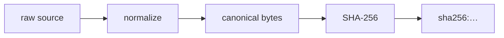
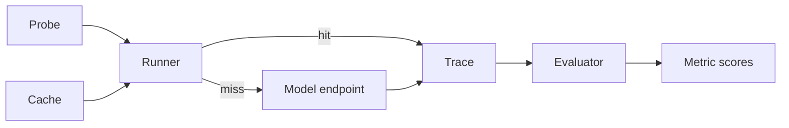

# AgentChecksum v0.1 — Design Specification

**Status:** Approved design, pre-implementation
**Date:** 2026-09-15
**Scope:** AgentChecksum v0.1 (MVP)
**License:** MIT OR Apache-2.0

---

## 1. Problem and positioning

> **AgentChecksum is a language-agnostic dependency fingerprint and behavioral regression gate for AI agents.**

An agent's behavior does not depend only on its source code. It depends on the model, the model's
content digest and quantization, the chat template, inference parameters, system prompts, prompt
files, MCP servers, MCP tool inventories, tool descriptions, tool schemas, tool capabilities and
retrieval/policy configuration. Any of these can change while the agent still compiles, starts, and
runs — silently changing behavior.

AgentChecksum answers two questions, in that order, and keeps them strictly separated:

```text
WHAT changed?   →  Dependency Checksum   (deterministic, offline, fast)
DID it break?   →  Behavior Gate         (statistical, calls a model)
```

The product is not a generic observability platform, a tracing dashboard, an agent framework, or an
eval SaaS. Every feature must directly serve *dependency-change → behavior-impact*. The following
test is applied to every proposed feature:

> **"Does this feature have value when no dependency changed?"** If yes, it is out of scope.

### 1.1 Market boundary

| Adjacent field | What they ask | Where AgentChecksum stops |
|---|---|---|
| Agent lockfiles / manifest drift | "Does the manifest match reality?" | We do not stop at matching; we fingerprint model content digests, chat templates, quantization, capabilities, and MCP tool *descriptions*, then measure behavior |
| MCP contract testing | "Does the server conform to the protocol/types?" | We never call tools; we ask whether the *agent's tool-invocation behavior* changes when a tool *declaration* changes |
| Model capability regression | "Did the model drop on a benchmark?" | We do not measure answer quality and ship no benchmark suite; we compare *your recorded behavior* on *your probes* |
| Behavioral eval frameworks | "Score across a dataset" | We reject LLM-as-judge in the core, keep small deterministic probe suites, and output a *gate*, not a score. They run alongside us |
| Observability platforms | Runtime telemetry, dashboards, servers | Build-time, static, serverless, no DB, CI-native. We never ingest production traffic |

---

## 2. Terminology

```text
AgentChecksum
├── Agent Manifest        behavior-relevant dependency declaration (agentchecksum.toml)
├── Dependency Checksum   deterministic fingerprint of the normalized dependency state
├── Dependency Diff       semantic change set between a baseline and the current state
├── Behavioral Probes     small, deterministic-first scenarios that exercise agent behavior
└── Behavior Gate         regression policy that turns probe results into a CI verdict
```

Additional terms used by this specification:

- **Facet** — a named, independently digested slice of one dependency (e.g. a tool's `description`
  is a different facet from its `input_schema`).
- **Era** (MCP) — *modern* protocol revisions carry version/identity/capabilities as per-request
  metadata (`2026-07-28` and later); *legacy* revisions establish a session with an `initialize`
  handshake (`2025-11-25` and earlier). A *dual-era* implementation supports both.
- **Trace** — a recorded observation of agent behavior (tool calls, arguments, final text). Pure data.
- **Runner** — the component that *produces* a Trace.
- **Evaluator** — a pure function that scores a Trace against probe expectations.

---

## 3. Scope

### 3.1 v0.1 — must have

1. Dependency kinds: **Model**, **Prompt**, **Tool** (discovered via MCP), **McpServer** (identity).
2. `agentchecksum.toml` + generated `agentchecksum.lock`, byte-deterministic for identical semantic input.
3. Canonicalization rule set for JSON/JSON Schema and text (§7).
4. Semantic `diff` with facet-level reporting and deterministic heuristic risk classification (§8).
5. MCP discovery over **stdio** and **Streamable HTTP**: protocol era, `tools/list` with full cursor
   pagination, tool facet extraction (§9).
6. Behavioral probes in TOML with five expectation types; six deterministically derived metrics (§10).
7. Trace-based evaluation with a model runner (OpenAI-compatible), on-disk trace cache, and an
   offline `--trace` evaluation path (§11).
8. Baseline, policy, exit codes, human output, `--format json` (§12).
9. A reproducible killer demo and a GitHub Action template (§15).

### 3.2 Explicitly deferred (architecture must not preclude)

Framework adapters and the external adapter/process protocol; trace ingestion from third-party
harnesses; `Skill`, `Retrieval`, `Policy` dependency kinds; regex argument matchers; LLM-as-judge
(never in the core); git integration inside the binary; SBOM/SARIF export; signed lockfiles;
remote baselines; historical trend storage; SQLite; additional providers; WebAssembly or Python
bindings; multi-crate workspace.

### 3.3 Explicitly out of scope (product identity, not backlog)

SaaS, accounts, teams, billing, web UI, dashboards, distributed tracing, production telemetry,
vector databases, agent framework code, prompt-injection firewalls, full agent IAM, plugin
marketplace.

---

## 4. CLI

The CLI is the product's primary UI. There is no frontend.

```text
agentchecksum init       Scaffold agentchecksum.toml and a probes/ directory.        [WRITE]
agentchecksum snapshot   Discover dependencies and write agentchecksum.lock.         [WRITE]
agentchecksum diff       Compare committed lock against live state.                  [READ]
agentchecksum check      Run diff + probes + policy and produce a gate verdict.      [GATE]
agentchecksum inspect    Debug view: dependencies, MCP server, probes.               [READ]
```

There is deliberately **no `probe` command**. Running probes is `check`'s responsibility; a separate
command would duplicate exit-code and output semantics for no independent value. Debugging needs are
met by `check --probes-only` and `check --diff-only`.

`inspect` is in v0.1 because MCP failures must be diagnosable without a full gate run, and because
error messages point at it:

```text
agentchecksum inspect deps            Every dependency with per-facet digests
agentchecksum inspect mcp <alias>     Server identity, era, protocol version, tool inventory
agentchecksum inspect probes          Parsed probe suite and the metrics each probe feeds
```

### 4.1 Command contracts

| Command | Mutates | Network | Requires model |
|---|---|---|---|
| `init` | `agentchecksum.toml`, `probes/` | no | no |
| `snapshot` | `agentchecksum.lock` | yes (MCP; model metadata) | no |
| `diff` | nothing | yes (MCP; model metadata) | no |
| `check` | `baseline.json` (only with `--accept`), `.agentchecksum/runs`, `.agentchecksum/cache` | yes | yes (unless `--no-probes`) |
| `inspect` | nothing | yes (MCP) | no |

**Invariants**

- `check` **never writes the lockfile**. This makes `check` safe as a read-only CI step.
- `snapshot` is the only command that writes the dependency baseline; `check --accept` is the only
  command that writes the behavioral baseline.
- If probes cannot run (no endpoint, unreachable model), `check` **must not** report PASS. It exits
  `3` with an actionable message unless `--no-probes` was passed explicitly.

### 4.2 Flags

```text
--format human|json          Output format (default: human). JSON goes to stdout alone.
--config <path>              Config path (default: ./agentchecksum.toml)
--lock <path>                Lock path (default: ./agentchecksum.lock)
--diff-only                  Run dependency diff and gate on drift/risk only.
--probes-only                Run probes only.
--no-probes                  Skip probes (implies drift-only gate).
--fail-on-drift              Fail when the lockfile drifts, even with no baseline.
--fail-on-risk <level>       none|low|medium|high|critical (default: off; config may set it)
--accept                     Record the current successful run as the behavioral baseline.
--from <path>                Compare against a different lockfile instead of the committed one.
--trace <path>               Evaluate a recorded trace instead of calling a model.
--refresh                    Ignore the trace cache and re-sample.
--repeat <n>                 Override probe sample count.
--jobs <n>                   Probe concurrency for the model runner.
-v/--verbose, -q/--quiet     Diagnostics verbosity (overrides RUST_LOG default).
```

### 4.3 Exit codes

| Code | Meaning |
|---|---|
| `0` | Pass — no drift beyond policy, no regression |
| `1` | Gate FAIL — behavioral regression, drift policy violation, or risk threshold exceeded |
| `2` | Usage error (argument parsing) |
| `3` | Runtime error — config, discovery, network, unsupported input, internal |

Human-readable output goes to **stdout**; all diagnostics go through `tracing` to **stderr**, so
`agentchecksum check --format json | jq` is always clean.

---

## 5. Configuration (`agentchecksum.toml`)

User-owned, hand-edited, reviewed, committed.

```toml
version = 1

[agent]
name = "research-agent"

[model]
provider = "ollama"                    # ollama | openai-compatible
id = "qwen3:8b"
endpoint = "http://localhost:11434"    # native API (Ollama) for metadata
params = { temperature = 0.0, seed = 42 }   # behavior-relevant inference parameters

[[prompts]]
path = "prompts/system.md"

[[mcp.servers]]
name = "github"                        # deterministic alias → dependency id prefix
transport = "stdio"
command = "npx"
args = ["-y", "@modelcontextprotocol/server-github"]
env = { GITHUB_TOKEN = "${GITHUB_TOKEN}" }

# Streamable HTTP servers are described the same way:
# [[mcp.servers]]
# name = "remote"
# transport = "streamable-http"
# url = "https://example.com/mcp"

[probes]
path = "probes"
repeat = 3                             # default samples per probe

[policy]
fail_on_risk = "critical"

[policy.metrics.tool_selection]
min = 0.95

[policy.metrics.argument_validity]
max_drop = 0.05

[policy.metrics.forbidden_tool_usage]
max = 0.0
```

Notes:

- `params` is hashed as a **source**: the configured values are fingerprinted separately from the provider's
  reported defaults rather than merged into an effective set (§7.5 explains why the merge is deliberately not
  attempted).
- `${VAR}` expansion is supported for `env` values only. Expanded values are **never** written to the
  lockfile.
- The `name` alias — not MCP `serverInfo.name` — determines dependency identity, because the MCP
  specification does **not** guarantee `serverInfo.name` uniqueness across servers.

---

## 6. Generated state

```text
agentchecksum.lock            committed — the dependency baseline
.agentchecksum/
├── baseline.json             committed — the behavioral baseline
├── runs/<checksum>.json      gitignored — machine-local run results
└── cache/<key>.json          gitignored — recorded traces
```

`agentchecksum.lock` is JSON: the canonical-JSON story, and future SBOM/JSON-Schema export, stay in
one format. It is written with deterministic ordering (keys sorted by dependency id; ids are kind-prefixed,
so dependencies group by kind), 2-space indentation, and a trailing newline. The aggregate's own sort is by
`(kind, id)` (§8.1) — the two orders differ, because enumeration order and id-prefix order are not the same,
and neither is load-bearing beyond being deterministic.

```jsonc
{
  "lock_version": 1,
  "generator": { "name": "agentchecksum", "version": "0.1.0" },   // NOT hashed
  "agent_checksum": "ac1:72b5a918…",
  "dependencies": {
    "model:ollama/qwen3:8b": {
      "kind": "model",
      // External, un-versioned source → `normalized` is recorded alongside each
      // facet's digest, so a payload and its digest cannot drift apart. The facets
      // whose values the risk table names record a payload; `template` does not,
      // being large with little diff value.
      "facets": {
        "identity": {
          "digest": "sha256:…",
          "normalized": { "family": "qwen3", "parameter_size": "8.0B",
                          "quantization_level": "Q8_0", "digest": "sha256:…" }
        },
        "params":       { "digest": "sha256:…",
                          "normalized": { "configured": { "temperature": 0.0 },
                                          "reported": { "num_ctx": ["2048"] } } },
        "template":     { "digest": "sha256:…" },
        "capabilities": { "digest": "sha256:…", "normalized": ["completion", "tools"] }
      }
    },
    "prompt:prompts/system.md": {
      "kind": "prompt",
      // Repo-local file → digest only; git already versions the content.
      "facets": {
        "content": { "digest": "sha256:…" },
        "shape":   { "digest": "sha256:…" }
      }
    },
    "mcp:github": {
      "kind": "mcp",
      "facets": {
        "identity": {
          "digest": "sha256:…",
          "normalized": { "era": "modern",
                          "protocol_version": "2026-07-28",
                          "supported_versions": ["2026-07-28"],
                          "server_info": { "name": "github-mcp", "version": "1.4.0" } }
        }
      }
    },
    "tool:github.search_repositories": {
      "kind": "tool",
      "server": "github",
      // External, un-versioned source → normalized form recorded so that a later
      // `diff --from old.lock` can explain WHAT changed, not just THAT it changed.
      "facets": {
        "input_schema":  { "digest": "sha256:…", "normalized": { /* canonical JSON */ } },
        "output_schema": { "digest": "sha256:…" },
        "description":   { "digest": "sha256:…", "shape": "sha256:…",
                           "normalized": "Search repositories…" },
        "capabilities":  { "digest": "sha256:…" }
      }
    }
  }
}
```

### 6.1 Two serializations, one checksum

The human-facing lockfile layout and the hash input are **separate artifacts**:

- The lockfile is pretty-printed for review and diffing.
- `agent_checksum` and every digest are computed from in-memory canonical bytes of the dependency
  facets only.

**Invariant:** re-indenting the lockfile, or changing its field order, must not change
`agent_checksum`. This is a tested invariant, not an aspiration.

### 6.2 Unhashed metadata (explicit, tested list)

`generator` name/version, all timestamps, absolute paths, machine identifiers, discovery order,
Ollama's `modified_at` / `size` / `license`, and MCP cache hints (`ttlMs`, `cacheScope`).

### 6.3 Repo-local vs external sources

| Source | Recorded in lock |
|---|---|
| Repo-local file (prompt) | Digest only. git versions the content; a second copy would be a second source of truth |
| External, un-versioned (MCP tool schema/description, model metadata) | Digest **and** normalized form |

This asymmetry exists because a PR's CI only has the lockfile from `HEAD`. Without the recorded
normalized form, `diff --from old.lock` could report *that* a remote tool schema changed but not
*what* changed — which would gut the "WHAT changed?" half of the product.

---

## 7. Fingerprinting



### 7.1 Hash function

**SHA-256.** Not BLAKE3: we need no speed advantage, and SHA-256 is the same alphabet as Ollama's
model `digest`, is universally recognized in CI, and can be verified by hand with `sha256sum`.

### 7.2 JSON canonicalization

**RFC 8785 JSON Canonicalization Scheme (JCS)**, via the `serde_json_canonicalizer` crate. Chosen
over a hand-rolled canonicalizer so that key ordering, whitespace, and number formatting are settled
by a published specification rather than by our own invention. JCS normalizes `1.0` to `1`, closes
the `1`/`1.0` trap, and sorts object keys recursively.

### 7.3 Semantic normalization rules above JCS

A short, documented, individually tested rule list:

| # | Rule | Rationale |
|---|---|---|
| 1 | Sort `required` arrays | Order is meaningless in JSON Schema |
| 2 | Sort `enum` arrays | Order is meaningless for validation |
| 3 | Resolve a missing `$schema` to the 2020-12 default | The MCP specification defaults to 2020-12 when `$schema` is absent |
| 4 | Text: unify line endings (CRLF→LF) and strip a leading BOM — nothing else | The only differences a platform introduces on its own |

**Content and shape are separate digests, and the split is deliberate.** A text facet carries a `content` digest and a
`shape` digest. `content` stays faithful to the text the model actually receives, so trailing spaces, leading and
trailing blank lines, a trailing newline and interior whitespace all change it — each of them changes what the model
sees, and assuming otherwise would hide a real runtime difference. `shape` collapses every whitespace run to one space,
which is what lets a formatting-only edit be *classified*, in Phase 2's diff and risk table, instead of being silently
discarded at fingerprint time. A platform-only line-ending difference is the one case where `content` may stay
identical.

### 7.4 Deliberately **not** normalized

`description`, `title`, `examples`, `default`, and `x-mcp-header` are **never** stripped or
canonicalized away.

The reason is the product's core thesis. These keywords are irrelevant to *validation* but are
arguably the most behavior-relevant content in a tool definition, because the schema is serialized
into the model's context. Treating them as noise would hide exactly the class of change
AgentChecksum exists to catch. Rule 3 above is permissible only because it is a specification-level
equivalence, not a judgement about importance.

### 7.5 Facets per dependency kind

| Kind | Facets |
|---|---|
| `Model` | `identity` (provider, id, content `digest`, quantization level, family, parameter size, and — for a provider that exposes no content digest — `endpoint`), `params` (**parameter sources**: `configured` from `[model].params`, `reported` from Ollama's `parameters` text, fingerprinted separately rather than merged), `template` (chat template), `capabilities` (e.g. `completion`, `tools`) |
| `Prompt` | `content` (faithful to the text the model receives), `shape` (whitespace-collapsed, for formatting-only detection) |
| `Tool` | `input_schema`, `output_schema`, `description` (+ `shape`), `capabilities` |
| `McpServer` | `identity` (era, protocol version, supported versions, server info) |

`shape` digests exist so that "whitespace-only change" (LOW) can be distinguished from a semantic
change (MEDIUM) deterministically, without an LLM.

The `template` and `capabilities` facets are included because both produce silent behavior breaks: a
different chat template changes prompt formatting without touching any source file, and losing the
`tools` capability means the agent stops calling tools entirely.

### 7.6 Provider reality

- **Ollama** exposes a real content `digest` (SHA-256), `quantization_level`, `parameter_size`,
  `family`, `template`, `capabilities`, and parsed `parameters` — a strong determinism signal.
- **Generic OpenAI-compatible** endpoints expose no model digest (`/v1/models` returns only `id`, `created`,
  `owned_by`), so the **endpoint participates in model identity**: two hosts serving a model with the same name can
  be entirely different deployments, and leaving the host out would make moving between them look like no change at
  all. The endpoint must be an **HTTP(S) base URL with no userinfo, no query parameters and no fragment**; a trailing
  slash is insignificant. Unsupported components are **rejected, never silently discarded**, because they may affect
  routing or model selection — `?deployment=a` and `?deployment=b` can reach different deployments behind one host —
  and because a sanitizer that parses a credential before discarding it still handles a secret that a committed
  lockfile must never contain. An endpoint is therefore **required** for this provider: with none, there is nothing
  to fingerprint the model by. The remaining false negative is declared in output rather than hidden — *a model
  swapped behind the same endpoint cannot be detected.*

This is a real class of false negative and is declared in output, not hidden.

---

## 8. Agent checksum, diff, and risk

### 8.1 Agent checksum

```text
dep_digest     = sha256( JCS({ facet_name: facet_digest, … }) )
agent_checksum = "ac1:" + sha256( JCS({ "deps": [ [kind, id, dep_digest], … ] }) )
```

Dependencies are sorted by `(kind, id)` before aggregation, so the aggregate is **order-independent
by construction**.

**Merkle trees are not used in v0.1.** A Merkle structure earns its keep for partial verification or
incremental recomputation; neither applies here. `snapshot` re-scans the whole dependency set, and the
set is in the dozens to hundreds. Per-dependency digests already answer "which subtree changed". If
remote baselines or registries with thousands of tools appear, this decision is revisited.

The `ac1` prefix versions the aggregation format independently of `lock_version`.

### 8.2 Dependency diff

Three axes: **Added / Removed / Modified**. `Modified` is reported at facet level with a semantic
detail and a risk level.

A report describes a **comparison**, not only a delta. A modified dependency lists *every* facet
present on either side, including the facets that were compared and found equal, marked
`unchanged`. This is not decoration: "the schema did not break, the description did" (§15.1) is the
product's sharpest sentence, and without the unchanged lines a reader cannot tell a facet that was
checked from a facet that was never looked at. A consumer that wants only the delta filters on
`change != "unchanged"`. Facets that did not move carry `risk: "none"` and no details.

Diff sources: the committed `agentchecksum.lock` versus live discovery, or `--from <path>` for
another lockfile. The binary has no git integration; CI provides the old lockfile
(`git show HEAD:agentchecksum.lock > /tmp/old.lock`).

The baseline is verified before anything is discovered: if a lockfile's recorded `agent_checksum`
does not describe the entries beside it, the comparison is against a baseline that never existed, so
`diff` refuses with exit 3 rather than reporting a diff against a fabricated state. Verification
recomputes the aggregate from the entries; it does not re-derive the individual facet digests, whose
derivation is not recorded in the lockfile.

Semantic interpretations produced for schema changes (closed set, v0.1):

`required` field added/removed · `enum` value added/removed · property added/removed ·
`type` changed · `additionalProperties` tightened/loosened · description changed ·
formatting-only change.

Anything outside this set is reported as a generic schema change. Classification is fail-safe:
an unrecognized change never scores below MEDIUM.

Two details of that fail-safe decide what "an unrecognized change" means once a schema differs in
more than one place, so they are stated rather than implied:

- **The floor composes with whatever was named.** A schema whose property description changed *and*
  whose `examples` changed is not a MEDIUM change with a footnote. The analyzer reports the
  differences it can name and, *separately*, whether anything differed that it could not name; the
  risk is the maximum of the named rows and the generic floor. A change that is part understood and
  part not is not a classified change, and reporting only the understood half is precisely the
  under-reporting this rule exists to prevent. The same applies to a difference sitting past the
  analyzer's depth bound: unreached is not unchanged.
- **`additionalProperties` is ordered only where a bounded analyzer can order it.** `false` against an
  absent key, `true`, or `{}` is a direction. `{}` constrains nothing and therefore says exactly what
  `true` says, so a difference between those permissive forms is not a change at all. Two
  schema-valued forms are compared but not ordered — ranking them needs reasoning this analyzer does
  not do — so they fall to the generic floor rather than claiming a direction they cannot support.
- **A moved fingerprint is not by itself a change.** The fingerprint layer answers "did the normalized
  state change"; the semantic layer answers "did that change mean anything". When two supported forms
  are equivalent — `additionalProperties` absent, `true`, and `{}` are one such family — the analyzer
  concludes **equivalence**: the facet is reported as unchanged with both fingerprints kept as
  evidence, and no risk is attached. An aggregate checksum can therefore differ while the semantic
  diff reports nothing, and that is a valid state rather than a stale one. Meaning is never inferred
  from an empty list of named differences: "no difference in meaning" and "a difference this analyzer
  cannot account for" are separate conclusions, and only the second one takes the floor. Unknown or
  unsupported differences are unaffected by this and still fall to the generic risk floor.

```text
AgentChecksum diff

Baseline: ac1:72b5a918…
Current:  ac1:c4d1e07f…

1 dependency changed.

TOOL  demo-tools.search_repos                MEDIUM
  description    sha256:11aa88ff… → sha256:99bbccdd…
    classification: text-changed
  input_schema   unchanged
  output_schema  unchanged

Overall behavioral risk: MEDIUM (heuristic)
```

Layout rules: the kind and the dependency's identity (without its redundant kind prefix) form the
header, with the dependency's risk in the last column; one line per facet, showing the fingerprint
that moved (`sha256:` plus eight hex characters and an ellipsis) or the word `unchanged`; semantic
details indented beneath the facet they explain; the verdict last, always qualified as
`(heuristic)` because §8.3's table is a judgement, not a security fact. `diff` exits **0** whenever
the comparison ran, whatever the risk: turning risk into a failing build is the gate's job (§12.2),
and conflating "found danger" with "failed to compare" would make the exit code useless.

### 8.3 Risk classification

> Risk levels are **AgentChecksum's default heuristic classification**, not universal security
> truths. They encode "how likely is this change to alter agent behavior", nothing more. Capability
> signals derived from MCP `annotations` are additionally labeled as server-declared and untrusted,
> per the MCP specification's own warning that clients must treat annotations as untrusted unless
> they originate from a trusted server.

v0.1 implements risk as a **pure function over a diff** — no I/O, no model, no configuration knobs.
This is the table the code asserts, row by row, in `src/diff/risk.rs`.

**Text, tool, model, and server changes**

| Change | Risk |
|---|---|
| Text facet changed formatting only (equal `shape` digest) | LOW |
| Prompt content changed · tool description changed | MEDIUM |
| A prompt dependency added | MEDIUM |
| Inference parameters changed · a model or server capability added · server implementation info changed | MEDIUM |
| A facet whose digest changed and no analyzer could explain it | MEDIUM, or HIGH for a schema facet |
| A model, tool, or server dependency added | HIGH |
| A newly added tool whose own declaration names it write-capable **and** destructive | CRITICAL (declared, not proven — §9.5) |
| Tool removed · a prompt dependency removed | HIGH |
| Quantization changed · chat template changed · endpoint identity changed (openai-compatible) · a model gained or lost any other capability · an identity subfield changed that we cannot name | HIGH |
| MCP protocol era or version changed · a server dependency removed | HIGH |
| Server `instructions` rewritten | MEDIUM |
| Server `instructions` reflowed (equal `shape` digest) | LOW |
| Gaining a facet | MEDIUM, or HIGH for a schema facet |
| Losing a facet | HIGH |
| Model removed · provider, family, or parameter size changed · content digest changed (same id) | CRITICAL |
| Model lost the `tools` capability | CRITICAL |
| A dependency whose id is unchanged but whose kind is not | CRITICAL |
| A new destructive/write-capable tool, declared via MCP `annotations` | CRITICAL — **Phase 3**, it needs the server's annotations |
| Unclassifiable change | never below MEDIUM |

**Schema changes, by side.** The same structural change carries different risk per side: an input
schema decides whether the agent's calls are still valid, an output schema decides whether the caller
can still parse what comes back.

| Change | Input | Output |
|---|---|---|
| `required` field added | CRITICAL | MEDIUM |
| `required` field removed | MEDIUM | CRITICAL |
| `type` changed | CRITICAL | HIGH |
| Property removed | HIGH | HIGH |
| `enum` value removed | HIGH | HIGH |
| `enum` value added | MEDIUM | MEDIUM |
| Optional property added | LOW | LOW |
| A property `description` changed, added, or removed | MEDIUM | MEDIUM |
| `additionalProperties` tightened | HIGH | HIGH |
| `additionalProperties` loosened | MEDIUM | MEDIUM |
| Anything the analyzer cannot name | HIGH | HIGH |

Three positions are worth stating explicitly, because they were argued rather than derived:

- **Adding a required input field, or changing an input `type`, is CRITICAL — not HIGH.** This is the
  canonical silent breakage (§15.2): every previously valid call becomes invalid at once. The other
  input-schema rows stay where the sketch put them; these two do not.
- **Adding an optional property is LOW — not MEDIUM.** It is purely additive: it cannot invalidate a
  call that already worked, and it cannot break a caller's parser. Calling it MEDIUM would put a false
  alarm on the most common `fail_on_risk` threshold, which is how a gate loses its audience. The change
  is still reported with its fingerprint — LOW is a claim about risk, not about visibility.
- **An MCP protocol-era change is HIGH.** The tool surface, lifecycle, and discovery semantics come
  from the protocol revision itself, not from configuration, so a revision change can alter behavior
  with no dependency changing at all.

Two consequences of the tables above that are easy to miss:

- **A model id change is a removal plus an addition**, and the removal decides: CRITICAL.
- **A kind mismatch is CRITICAL and stands alone.** Facet maps produced under different kinds are not
  comparable, so reporting it as "some facets changed" would be a silent reinterpretation of state we
  do not understand.
- **Removing a required property keeps both facts.** The property is gone (HIGH) and a required field
  is gone (CRITICAL on the output side), and the maximum decides — so a removed required output is
  CRITICAL, not HIGH. A removal must not erase the requirement it carried.

Overall risk for a diff is the **maximum** across changes, and is connectable to the gate via
`fail_on_risk`.

### 8.4 Machine-readable diff (`diff --format json`)

The JSON form is the CLI's contract, so it is typed in the code rather than assembled from strings:
field order is stable, change and risk values are lowercase tokens, and no prose is embedded — a
consumer reads structure, not sentences.

```jsonc
{
  "status": "ok",
  "changed": true,
  "overall_risk": "medium",
  "baseline_checksum": "ac1:…",
  "current_checksum": "ac1:…",
  "changes": [
    {
      "id": "tool:github.search_repositories",
      "kind": "tool",
      "change": "modified",
      "risk": "medium",
      "facets": [
        {
          "name": "description",
          "change": "modified",
          "risk": "medium",
          "before_digest": "sha256:…",
          "after_digest": "sha256:…",
          "details": [
            { "path": "classification", "change": "modified", "after": "text-changed" }
          ]
        },
        {
          "name": "input_schema",
          "change": "unchanged",
          "risk": "none",
          "before_digest": "sha256:…",
          "after_digest": "sha256:…",
          "details": []
        }
      ]
    }
  ]
}
```

- `kind` uses the lockfile's vocabulary (`model`, `prompt`, `tool`, `mcp`), which is the same token
  `as_str()` returns and the same one every id prefix uses: a server is `"kind": "mcp"` with an id of
  `mcp:github`. One vocabulary across the lockfile, the JSON report, and human output.
  `mcp_server` is still *accepted* when reading, because that is the spelling this enum produced
  before the contract was pinned; nothing writes it.
- `before`/`after` inside `details` appear only where the baseline recorded a normalized payload to
  read a value from. `before_digest`/`after_digest` are absent when the facet does not exist on that
  side.
- `"change": "unchanged"` with **differing** digests is not a contradiction: the facet was compared
  and found semantically equal — `additionalProperties` absent against `{}`, say — while its
  fingerprint moved. Both facts are carried, because reporting the risk would be a false alarm and
  dropping the facet would hide a fingerprint the lockfile itself still disagrees on.
- `status: "ok"` means the comparison ran, regardless of risk. A runtime failure is exit 3 with the
  diagnostic on stderr and nothing on stdout, so `agentchecksum diff --format json | jq` is always
  parseable.
- `changes` is empty and `changed` is `false` when nothing moved — including when the two aggregate
  checksums differ but no dependency does, which is the honest answer for a stale aggregate.

---

## 9. MCP integration

Implemented in `src/discovery/mcp/`, in the shape the rest of the crate uses: `client.rs` is the only
I/O (connect, introspect, close), `normalize.rs` is pure and turns the SDK's model into plain data,
`limits.rs` holds every bound in one place, and `mod.rs` turns a `DiscoveredServer` into dependencies.
Nothing in the module decides severity: discovery reports what a server declared, and the risk policy
(§8.3) decides what that means, exactly as it does for models and prompts.

### 9.1 Protocol era and lifecycle

The current MCP revision (`2026-07-28`) has **no negotiation handshake**. Every request declares the
protocol version, client identity, and client capabilities in its own `_meta` field; the server
accepts or rejects each request independently. Servers **MUST** implement `server/discover`.

| Era | Revisions | Lifecycle | Recorded `era` token |
|---|---|---|---|
| **Stateless** | `2026-07-28` and later | Per-request `_meta`; no session; `server/discover` available | `stateless` |
| **Legacy** | `2025-11-25` and earlier | `initialize` / `notifications/initialized` handshake | `legacy` |

**How the session is established.** Two explicit steps, and only the peer can trigger the second one.

1. The stateless handshake: `ClientLifecycleMode::Discover` with `2026-07-28` preferred and `2025-11-25`
   as the fallback preference. Version negotiation inside the probe is the SDK's own retry loop: an
   `UnsupportedProtocolVersionError` (code `-32022`, `data` carrying `supported` and `requested`) makes it
   re-ask with a mutually supported version, and a server whose list intersects ours in nothing fails the
   discovery.
2. The session handshake, `ClientLifecycleMode::Initialize`, at `2025-11-25` — reached **only** when step 1
   failed with a *correlated* JSON-RPC error whose code is not a modern-era rejection. That is the one
   signal that means "this peer does not implement that method", and it is the same classification the SDK
   makes internally (its `DiscoverOutcome` and its version-sending `legacy_version` are not public, so the
   test is re-derived from the public error codes). Because the transport is consumed by the first attempt
   and is not returned on failure, the fallback opens a second connection or spawns a second child — a cost
   paid only on the path a server explicitly asked for.

The SDK's `ClientLifecycleMode::Auto` is deliberately **not** used. It also falls back when the probe
simply does not answer within its internal ten-second cap, which would let transient latency choose the
protocol era — and therefore the fingerprint: the same server, under load, would be recorded as legacy,
and identical declarations would produce a different dependency identity from one run to the next.

A **timeout is a failure**, never evidence of age. So are a transport or TLS error, an authorization
rejection, an uncorrelated or malformed response, and the modern rejection codes `-32021` (a client
capability the server requires) and `-32020` (header mismatch) — the last two say the peer *is* modern.
Each is reported as `McpFailed` or `McpTimeout` with the stage that failed, and none of them can produce a
legacy fingerprint. One consequence worth stating because it is a transport fact rather than a policy
choice: on Streamable HTTP the SDK's own transport synthesises that correlated error when a sessionless
`server/discover` is answered with a 4xx other than 401/403 — its way of saying the endpoint serves the
session protocol. The fallback therefore fires there too, and it still has to *succeed* to fingerprint
anything.

The stateless revision is named explicitly rather than taken from the SDK's `LATEST`, which still points
at `2025-11-25`: asking for `LATEST` would negotiate a session protocol against a server that supports
both, and the fingerprint would then describe an era the server does not have to be in.

**What is recorded.** The version this session actually *negotiated*, never the preferred one. `era` is
derived from that version alone, and the comparison is "at least `2026-07-28`" rather than equality, so a
newer revision is stateless as well. `supported_versions` is the server's own list from
`server/discover`, sorted and deduplicated because order and repetition carry no meaning there; when the
server does not report it, the field is omitted and discovery continues with a warning — a server that
exposes no discovery metadata still has a tool contract worth fingerprinting.

Recording the era is what makes a migration visible: the era decides how a server's declarations are
read, so a legacy-to-stateless switch is a detectable dependency change even when every tool schema stays
byte-identical.

**Client identity.** `agentchecksum` plus the crate version, with client capabilities left at their empty
default. No hostname, user, working directory, or random value: a server that groups or rate-limits
clients by identity must see the same client on every run, and a fingerprint must not depend on which
machine produced it. Declaring no capabilities is the smallest statement that is true — discovery does not
sample, does not offer roots, and does not render UI, and a server is entitled to change what it exposes
based on what a client says it supports.

### 9.2 Transports

| `transport` | Configuration | How it is started | Endpoint rules |
|---|---|---|---|
| `stdio` | `command`, `args`, `env` | The configured command is executed directly with the configured argument vector (`TokioChildProcess`) | — |
| `streamable-http` | `url` | `StreamableHttpClientTransport` over `http` or `https` | userinfo, query strings, and fragments are rejected rather than stripped; redirects are not followed |

- **stdio.** No shell is involved and none is searched for, so a command carrying shell syntax stays an
  argument instead of becoming a second command. The configured `env` is passed to the child. The child's
  stderr goes to `Stdio::null()`: a server is free to log whatever it likes, including the credentials it
  was started with, and a server's log line must never reach a diagnostic.
- **streamable-http.** The endpoint is validated by the config layer (§5) and an unsupported component is
  *rejected*, not removed — a query string can select a different deployment behind the same host, so
  stripping it would fingerprint a server the user did not configure. A redirect moves the trust boundary,
  so the endpoint a user needs is the one they configure.
- **Both.** One server at a time, one connection, closed before the next one starts. Closing is awaited
  under its own timeout, and a session that will not close cleanly is a warning rather than a failure.
  Nothing else about the session — PIDs, ports, session ids, cache TTLs, timings — reaches a fingerprint.

Config validation (§5) settles the combinations before discovery runs: `stdio` requires a `command` and
refuses a `url`, `streamable-http` requires a `url` and refuses `command`, `args`, and `env`, and a
duplicate alias is an error. A mistyped server therefore fails as configuration rather than as a server
that will not talk.

### 9.3 Identity and dependency ids

| Unit | Dependency id | Lockfile `kind` token |
|---|---|---|
| Configured server | `mcp:<alias>` | `mcp` |
| Tool | `tool:<alias>.<name>` | `tool` |

The alias is the user's config `name`, and it is a namespace rather than a display name: it prefixes every
dependency id the server produces. The grammar is `[A-Za-z0-9_-]+`, at most 64 bytes
(`MAX_ALIAS_BYTES`), and the load-bearing exclusion is the dot — `tool:<alias>.<name>` splits on the first
dot, so an alias containing one would let two different servers produce one tool identity. Renaming an
alias is deliberately an *identity change*: every id changes with it, so the old dependencies are removed
and the new ones added, which is the honest description of what happened. `serverInfo.name` never
determines identity, because the protocol does not guarantee it is unique; it is recorded as metadata
only.

A tool name is quoted into the id by percent-encoding, with `%` escaped first: bytes in `[A-Za-z0-9._-]`
pass through and everything else becomes `%XX`. The mapping is injective — two distinct names cannot
produce one id, and a literal `%` cannot be mistaken for the start of an escape — while a name that
already follows the protocol's plain-identifier guidance comes through unchanged. Encoded names are
counted and reported as one warning for the category, not one per tool; the names themselves are already
in the lockfile.

### 9.4 Facets

| Dependency | Facets |
|---|---|
| `mcp:<alias>` | `identity`, `instructions` (only when declared) |
| `tool:<alias>.<name>` | `description`, `input_schema`, `output_schema` (only when declared), `capabilities` |

**`identity`** (server) is a small object: `era`, the negotiated `protocol_version`, `supported_versions`
and `server_info` (`name` + `version`) when the server reported them, and `capabilities` when it declared
any. Optional fields are *omitted* rather than filled with an empty default, because "the server did not
tell us" is not the same statement as "the server told us nothing". Declared capabilities are recorded by
name with their declared flags (`list_changed`, `subscribe`), defaulting an absent flag to `false`, so an
undeclared flag and a declared `false` read the same; `logging` and `completions` are recorded as presence
only.

**`instructions`** (server) is the guidance the server gives the model about how to use it, and it is a
facet of its own rather than a field inside `identity`, because identity describes the implementation while
instructions describe what the server asks of the agent. Folding them together would make a wording edit
look like a change of identity. It exists only when the server declares it; a facet that appears or
disappears is classified generically (added MEDIUM, removed HIGH), because there is no text pair to compare.

**`description`** and **`instructions`** record a digest over the normalized text plus a `shape` digest over
the whitespace-collapsed text, and no `normalized` payload. This is the contract a prompt's
`content`/`shape` pair already uses, and for the same reason: both are model input, so a reflow and a
rewrite must be distinguishable and Phase 2 makes that call. The lockfile therefore contains hashes, not
server prose.

**`input_schema`** and **`output_schema`** record the normalized schema as their payload, with the digest
taken over exactly that value, so a stored payload can be re-hashed from the lockfile alone. `output_schema`
exists only when the server declares one. The schema's `type` is never rewritten: an output schema may
legitimately describe an array or a scalar, and forcing `type: object` would misdescribe the contract.

**`capabilities`** is the effective annotation token set (§9.5), recorded sorted.

Both dependencies carry `source` = the alias: provenance only, never hashed.

### 9.5 Annotation vocabulary

`annotations` are four protocol-defined hints, and the fingerprint records their *effective* value with the
protocol's own defaults folded in:

| Hint | Default | Tokens |
|---|---|---|
| `readOnlyHint` | `false` | `read-only` / `write` |
| `destructiveHint` | `true` | `destructive` / `non-destructive` |
| `idempotentHint` | `false` | `idempotent` / `non-idempotent` |
| `openWorldHint` | `true` | `open-world` / `closed-world` |

Folding the defaults in is what keeps "declared the default" from reading as a change: a tool with no
annotations, a tool that declares `false`/`true`/`false`/`true` explicitly, and a tool whose hints are all
absent produce one and the same token set. `destructive`/`non-destructive` and
`idempotent`/`non-idempotent` appear only for a tool that writes, because the protocol defines them as
meaningful only there — so a read-only tool is `read-only` plus one world token, and declaring write-only
hints on it creates nothing to diff.

These are declarations, not guarantees (§8.3): a server that declares `read-only` may still write.
AgentChecksum reports that the hint says so and claims nothing further.

### 9.6 Deliberate exclusions

| Excluded | Why |
|---|---|
| Tool `title`, `icons` | Presentation. They cannot change how a tool behaves, so fingerprinting them would turn a cosmetic edit into a dependency change |
| Tool `_meta`, and the *settings* of extension and experimental capabilities | Opaque, server-controlled data; copying it into a committed lockfile turns a capture of arbitrary values into a dependency fingerprint. Extension and experimental capabilities are reduced to their sorted identifiers, with one aggregated warning |
| Implementation `title`, `description`, `websiteUrl` | Presentation. Only an implementation's `name` and `version` describe anything that can behave differently |
| Tool `_meta` *values* | Opaque, server-controlled data; only their presence is reported, in one aggregated warning per server (§9.6) |
| Configured `command`, `args`, `env` | Connection material, not contract. `env` is where a credential lives |
| Transport and session plumbing | PIDs, ports, session ids, cache hints (`ttlMs`, `cacheScope`), and timings are machine- or run-specific; §6.2 excludes them already |
| Server stderr | The server's own log, discarded and never read (§9.2) |

### 9.7 Bounds and failure policy

Every bound lives in `limits.rs`, and each one is the point where AgentChecksum refuses to be led by a
server that is broken, hostile, or merely enormous:

| Bound | Value | Applies to |
|---|---|---|
| `CONNECT_TIMEOUT` | 60 s | Connecting, spawning, and protocol negotiation for one server |
| `PAGE_TIMEOUT` | 30 s | One `tools/list` page, and the `server/discover` probe |
| `SHUTDOWN_TIMEOUT` | 10 s | Closing the session; expiry is a warning, not a failure |
| `MAX_TOOL_PAGES` | 200 | Pages followed before the catalog is called malformed |
| `MAX_TOOLS_PER_SERVER` | 10 000 | Tools accepted from one server |
| `MAX_TOOL_NAME_BYTES` | 256 | A tool name (the protocol's own naming guidance is far below this) |
| `MAX_TEXT_BYTES` | 64 KiB | A tool description, or a server implementation name/version |
| `MAX_SCHEMA_BYTES` | 512 KiB | One serialized tool schema |
| `MAX_SCHEMA_DEPTH` | 32 | Nesting inside one tool schema — tighter than the parser's own limit, deliberately, because the normalizer recurses |

Exceeding a bound **fails** the discovery; it never truncates. A truncated catalog would produce a
lockfile describing a server that does not exist, and a wrong checksum is worse than no checksum. Any
failure inside one server aborts the run and names the stage (`connecting and negotiating`, `reading the
server identity`, `reading the tool catalog`, …) as `McpFailed` or `McpTimeout` (§14).

Two catalog pathologies are errors rather than coincidences: a cursor the server has already returned
(the loop would otherwise be indistinguishable from real pagination), and one tool name declared twice by
one server (taking the first or the last would hide one dependency behind another).

**Ordering and atomicity.** Servers are visited in alias order — sequential on purpose, because a
configuration holds a handful of servers and a deterministic order is worth more than a shorter wall
clock — so the same configuration produces the same first failure and the same warnings, each warning
tagged with the server it came from. Inside one server, tools are sorted by name: a server answers in
whatever order it likes, and discovery order must never reach a fingerprint. Discovery is fail-closed. The
first server that cannot be fully discovered fails the command, no partial lockfile is written, and
`snapshot` writes nothing on any failure — it checks writability before discovery even starts. Every
dependency id is checked for uniqueness across all sources before a lockfile is built; two dependencies
with one id is an error, not a silent choice of one of them.

**One path.** `snapshot` and `diff` run the same discovery pass, so what `diff` compares against is
exactly what `snapshot` would record.

### 9.8 Integrity of recorded payloads

For every facet that records a payload, `digest == sha256(canonical(payload))` — and that is checked, not
assumed. A baseline lockfile is verified as it is loaded, before any semantic comparison reads a payload,
so a hand-edited payload that disagrees with its own digest is rejected instead of being allowed to steer
a risk decision. Facets without a payload (a prompt's `content`/`shape`, a tool's `description`) are
skipped: their digest covers text the lockfile deliberately does not store, so there is nothing to
recompute from. The check is bounded and documented as such: it is not a general proof that every digest
in a hand-written lockfile is honest.

### 9.9 Schema handling

- **`contentSchema` is a schema position.** The normalizer descends into it like `properties` or `items`,
  so a reordered `required` or `enum` inside it is not a change. Without that, an MCP tool's structured
  content schema would produce the very false positive rules 1 and 2 (§7.3) exist to prevent.
- **External `$ref` is never fetched.** No resolver exists; a reference is preserved as written and no
  request is made to dereference it.
- **Unknown keywords are preserved.** Normalization reorders arrays and fills in a missing root
  `$schema`; it never drops a keyword it does not recognize, so Phase 2's generic floor can still see a
  change it has no named classification for.
- **A non-object type root is preserved.** A schema whose `type` is an array or a scalar is recorded as
  the server declared it.

### 9.10 Scope and security posture

**Read-only.** Discovery is introspection: `tools/call` is never issued and no tool is ever executed. A
fingerprint of what a server declares is worth having on its own, and calling a tool to obtain one is not
something a lockfile step may do. Prompts, resources, resource templates, tasks, sampling, roots,
elicitation, and subscriptions are out of scope; `listChanged` is not tracked, because a snapshot is a
point-in-time statement and not a subscription.

**No secret-derived material.** The configured environment and the endpoint never reach the lockfile, so a
credential rotation that leaves the declared contract unchanged produces the same fingerprint and the same
agent checksum. When credentials do change what a server declares — a narrower authorized tool set, for
instance — that is a real dependency change and is reported as one.

**Redaction.** The values in `[mcp.servers.env]` are redacted out of every diagnostic, including text that
came from the server, because a server may echo back whatever it was started with. A failed spawn reports
the operating system's reason and never the environment the server would have been given; an endpoint
diagnostic names the component that is wrong rather than repeating the URL. Values shorter than six bytes
are not redacted: hiding `1` or `true` would mangle diagnostics without protecting anything.

---

## 10. Behavioral probes

### 10.1 Format

TOML, in `probes/`, alongside `agentchecksum.toml`.

TOML rather than YAML: `serde_yaml` is deprecated and unmaintained (its last release is tagged
`0.9.34+deprecated`), and adopting a maintained fork would mean carrying a second configuration
language and parser for no benefit. TOML handles multi-line prompts cleanly with `"""`.

```toml
[[probe]]
name = "repository-search"
prompt = "Find repositories about PostgreSQL vector search"
repeat = 3
expect_tool = "search_repos"
expect_args = { query = { contains = ["postgres"] } }
forbid_tools = ["delete_file", "shell_exec"]

[[probe]]
name = "inspect-only-restraint"
prompt = "Inspect this repository and summarize its structure."
expect_no_tool = true

[[probe]]
name = "pagination-limit"
prompt = "List at most 50 results."
expect_tool = "search_repos"
expect_args = { per_page = { equals = 50 } }

[[probe]]
name = "structured-output"
prompt = "Return the result in the required schema."
output_schema = "schemas/result.json"
```

### 10.2 Expectation types (v0.1: exactly five)

| Key | Meaning |
|---|---|
| `expect_tool = "<name>"` | The named tool must be called |
| `expect_args = { <path> = <matcher> }` | Argument matchers: `equals`, `contains` (substring for strings, membership for arrays), `one_of` |
| `forbid_tools = ["…"]` | None of these tools may be called |
| `expect_no_tool = true` | No tool may be called at all |
| `output_schema = "<path>"` | The final assistant message, parsed as JSON, must validate against this JSON Schema |

Every expectation is evaluated **deterministically against a Trace**. None requires a model call at
evaluation time and none uses an LLM judge. Regular-expression matchers are deferred.

### 10.3 Metrics

Metrics are **derived from expectation types**, not selected by the user. One probe may carry several
expectations; each metric is scored independently over that probe's samples.

| Metric | Source | Notes |
|---|---|---|
| `tool_selection` | `expect_tool` | Expected tool was called |
| `argument_validity` | **automatic** | Every emitted tool call's arguments must validate against that tool's `inputSchema` — zero configuration |
| `argument_expectation` | `expect_args` | User-declared argument matchers satisfied |
| `forbidden_tool_usage` | `forbid_tools` | Violation rate (inverted: 1.0 = no violations) |
| `tool_restraint` | `expect_no_tool` | No tool called when none should be |
| `structured_output_validity` | `output_schema` | Final output validates against the schema |

Two deliberate revisions to the original metric list:

- `required_tool_usage` is dropped — it measures the same event as `tool_selection` under a second
  name.
- `policy_adherence` is dropped — v0.1 has no policy dependency model, and shipping a metric whose
  input cannot be fingerprinted would be a promise the product cannot keep.

`argument_validity` is the most valuable of the six because it is free to author and completely
deterministic: it validates observed arguments against the **fingerprinted** schema.

**Yardstick caveat.** `argument_validity` is measured against the *current* schema. If a tool's
`input_schema` facet changed, the baseline and current scores were computed against different
yardsticks; that tool is flagged *yardstick changed* in the report and its score comparison is
annotated. When the schema is unchanged, the comparison is exact.

---

## 11. Runner, Trace, and cache



The split exists because probe execution is the one part of AgentChecksum that cannot be
deterministic. Dependency fingerprinting is exact; model sampling is not. Rather than blur them:

- **Evaluation is a pure function of a Trace.** Deterministic, offline, testable.
- **Capture is a separate step.** Its output is an artifact that can be committed, cached, and
  re-evaluated.

This is also the language-agnostic seam: v0.2 adapters and third-party harnesses only need to produce
a Trace.

### 11.1 Trace format

```jsonc
{
  "trace_version": 1,
  "probe": "repository-search",
  "captured_with": {
    "runner": "openai-compatible",
    "endpoint": "http://localhost:11434/v1",
    "model_digest": "sha256:…",
    "tools_digest": "sha256:…",
    "params": { "temperature": 0.0, "seed": 42 }
  },
  "samples": [
    { "index": 0, "seed": 42,
      "tool_calls": [ { "name": "search_repos", "arguments": { "query": "postgres vector search" } } ],
      "final_text": null }
  ]
}
```

Cache key: `sha256(JCS({model_digest, tools_digest, probe_name, prompt, repeat, params, sample_index}))`.

### 11.2 The v0.1 runner

One runner: **OpenAI-compatible `/v1/chat/completions` with `tools`**. Ollama is reached through this
same endpoint, so a single adapter covers both the local demo and the wider ecosystem.

Verified wire details that the implementation must handle:

- Ollama's OpenAI-compatible endpoint returns tool-call `arguments` as a **JSON string**, whereas its
  native API returns an object. Both are parsed into `serde_json::Value` before evaluation, and
  canonicalization applies to the parsed value, never to the raw string.
- `tool_choice` is **not supported**. "The model called no tool" is therefore a legitimate
  observation, which is precisely what `tool_restraint` measures.
- `seed` and `temperature` are supported and are set from `[model].params`.

### 11.3 Determinism, stated honestly

AgentChecksum is **deterministic about dependencies** and **statistical about model behavior**. The
mitigations are: `temperature = 0`, fixed `seed`, `repeat = N` samples with pass-rate thresholds
instead of single-shot booleans, and a trace cache so a green run can be re-verified offline. The
documentation must state this rather than imply that a probe result is bit-reproducible.

---

## 12. Behavior Gate

### 12.1 Baseline

`baseline.json` is produced by `snapshot` + `check --accept` and is **committed**, so CI compares
against the behavior recorded in the repository.

```jsonc
{
  "baseline_version": 1,
  "agent_checksum": "ac1:72b5a918…",
  "metrics": { "tool_selection": 1.0, "argument_validity": 1.0, … },
  "probes":  { "repository-search": 1.0, … }
}
```

### 12.2 Policy

Per metric: `max_drop` (drop relative to baseline), `min` (absolute floor), `max` (absolute ceiling,
used for `forbidden_tool_usage`). Top-level: `fail_on_risk`, plus CLI `--fail-on-drift` for teams
that want lockfile drift to fail before any baseline exists.

**Precedence rule (tested):** when both `min` and `max_drop` are configured, **both must hold**.
Satisfying one never excuses the other.

### 12.3 Verdict and output

Statuses: `Pass`, `Regression`, `Drift`, `Error`.

```text
Agent checksum changed: ac1:72b5a918… → ac1:c4d1e07f…

TOOL  demo-tools.search_repos                  MEDIUM (heuristic)
  description        changed
  input_schema       unchanged
  output_schema      unchanged

Behavioral probes: 9 / 15 passed

argument_validity           100% → 40%     FAIL
structured_output_validity  100% → 60%     FAIL
tool_selection              100% → 80%     PASS
forbidden_tool_usage        100% → 100%    PASS

Behavior Gate: FAIL                            exit 1
```

`--format json` emits a stable schema containing `status`, `agent_checksum`, `diff`, `metrics`, and
the gate verdict.

---

## 13. Rust architecture

A **single crate**, a single binary named `agentchecksum`.

```text
src/
├── main.rs            Thin: parse args, dispatch, map Error → exit code
├── cli/
│   ├── args.rs        clap derive definitions
│   └── cmd/           init.rs, snapshot.rs, diff.rs, check.rs, inspect.rs
├── config.rs          agentchecksum.toml (strict)
├── manifest/          Dependency, DependencyKind, Facet, Digest, AgentChecksum
├── discovery/         model.rs, prompts.rs
├── mcp/               era.rs (era probe), client.rs (rmcp wrapper, tools/list pagination)
├── fingerprint/       normalize.rs, canonical.rs (JCS + rules), digest.rs
├── lockfile.rs        Deterministic read/write
├── diff/              structural.rs, schema.rs (schema interpretations), risk.rs
├── probes/            probe.rs (TOML), eval.rs (pure), metrics.rs
├── runner/            openai.rs, trace.rs, cache.rs
├── gate/              baseline.rs, policy.rs, result.rs
├── report/            human.rs, json.rs
└── error.rs           thiserror enum with structured diagnostic fields
```

### 13.1 Dependencies and justification

| Crate | Why it is needed |
|---|---|
| `clap` (derive) | CLI parsing; hand-rolling argument handling is unjustifiable |
| `tokio` (rt-multi-thread, macros) | Required by the `rmcp` client and `reqwest` |
| `reqwest` (rustls, json) | Ollama metadata discovery and OpenAI-compatible probe calls |
| `rmcp` (`client`, `transport-child-process`, `transport-streamable-http-client-reqwest`) | Official MCP SDK; hand-written JSON-RPC would be a maintenance trap. `default-features = false` to drop the server/macros surface |
| `serde`, `serde_json` | Data model and lockfile |
| `toml` | Config **and** probes — one configuration language |
| `sha2` | SHA-256, matching Ollama's digest alphabet |
| `serde_json_canonicalizer` | RFC 8785 JCS — a specification instead of a hand-rolled canonicalizer |
| `jsonschema` | `output_schema` validation and observed-argument validation for `argument_validity` |
| `thiserror` | Structured errors; required to render the diagnostic format in §14 |
| `tracing`, `tracing-subscriber` (env-filter) | `RUST_LOG` diagnostics on stderr, keeping stdout machine-clean |

Dev-dependencies: `assert_cmd`, `predicates`, `insta`, `tempfile`, `wiremock`.

Consciously **not** used: `anyhow` (its stringly-typed context cannot supply the structured
`what/why/where/fix` diagnostics of §14), `blake3`, `dirs` (there is no global state), `serde_yaml`,
`regex`, and any timestamp crate (v0.1 needs no non-hashed timestamp; `baseline.json` carries its
provenance in `agent_checksum`).

Release profile: `lto = true`, `strip = true`, `codegen-units = 1`.

### 13.2 Code principles

Explicit types over traits; small modules; straightforward ownership; no `unsafe`; no macro
magic; no provider factory labyrinth; domain logic as deterministic pure functions. `DependencyKind`
is an enum matched directly — no dynamic dispatch. Abstractions are introduced only when a second
consumer exists.

---

## 14. Error handling

Structured errors in the domain and library layers; at the CLI boundary they render as
*what failed / why / where / how to fix*:

```text
Failed to fingerprint MCP tool `github.search_repositories`.

Reason:
  Unsupported schema construct: `$dynamicRef`.

Server:
  github (stdio)

Suggested action:
  Run `agentchecksum inspect mcp github` to see the full tool definition,
  or exclude this tool via [[mcp.servers]].exclude.
```

No uncontrolled `unwrap()` on production paths.

### 14.1 Format compatibility policy

Configuration and generated state follow **different** compatibility policies. This is deliberate:
they fail in different ways.

| Artifact | Owner | Read policy | Unknown fields | Version handling |
|---|---|---|---|---|
| `agentchecksum.toml` | user | **strict** (`deny_unknown_fields`) | hard error, exit 3 | `version` newer than supported → error with an actionable message |
| `probes/*.toml` | user | **strict** | hard error, exit 3 | inherits config `version` |
| `agentchecksum.lock` | generated | tolerant | ignored, preserved on rewrite where cheap | `lock_version` newer → refuse to compare or extend, exit 3 |
| `.agentchecksum/baseline.json` | generated | tolerant | ignored | newer `baseline_version` → refuse, exit 3 |
| `.agentchecksum/runs`, `cache` | generated, disposable | — | — | safe to delete; regenerated |

Rationale:

- **User-authored input fails loud.** A typo silently ignored means AgentChecksum fingerprinted
  something other than what the user believes they declared — a false sense of safety. `[modell]`
  must be an error.
- **Generated state fails safe against silent misinterpretation.** The dangerous outcome for a
  lockfile is not a parse error; it is reading a newer, unknown format as "nothing changed" and
  reporting PASS. Therefore an unknown *structure* or a higher `lock_version` is a hard refusal,
  while unknown *fields* inside a recognized version are tolerated because they cannot alter the
  meaning of the digests we do understand.

No migration framework is written for v0.1; there is exactly one version of every artifact. When a
version 2 exists, a migration chain is added explicitly.

---

## 15. Killer demo

### 15.1 The primary demo: one description, no schema change

> **"The API didn't break. The agent did."**

Setup, in `demo/agent/` and `examples/demo-tools-server.rs` (a tiny stdio MCP server shipped as a
cargo example, so the demo needs no Node, no Python, and no network beyond the model):

- Model: Ollama `qwen3:8b`; prompt `prompts/system.md` v1.
- MCP server `demo-tools` exposing `search_repos`, `read_file`, `delete_file`.
- Five probes covering all six metrics.

The "harmless documentation edit" that a maintainer would merge without a second thought:

```diff
-  "description": "Search repositories. `query` must be a plain natural-language phrase
-                  (for example `postgres vector search`), not a boolean expression.
-                  `per_page` must be an integer between 1 and 100; omit it to use the default."
+  "description": "Search repositories. `query` accepts a search expression.
+                  Returns matching repositories."
```

**The `inputSchema` is byte-identical before and after.** Only the `description` facet changes.

```text
$ agentchecksum check

AgentChecksum diff

Baseline: ac1:72b5a918…
Current:  ac1:c4d1e07f…

1 dependency changed.

TOOL  demo-tools.search_repos                MEDIUM
  description    sha256:11aa88ff… → sha256:99bbccdd…
  input_schema   unchanged
  output_schema  unchanged

Overall behavioral risk: MEDIUM (heuristic)

Behavioral probes: 9 / 15 passed

argument_validity           100% → 40%    FAIL
structured_output_validity  100% → 60%    FAIL
tool_selection              100% → 80%    PASS
forbidden_tool_usage        100% → 100%   PASS

Behavior Gate: FAIL                        exit 1
```

Why this is the right primary demo:

1. **It is not a contract break.** No schema change, no code change, no model change. Removing the
   parameter guidance from the description is exactly the class of edit that passes code review,
   passes API-compatibility checks, and silently breaks agents.
2. **The failure is measured, not asserted.** `argument_validity` validates the emitted arguments
   against the *unchanged* schema, so the drop is deterministic even though the model is
   statistical.
3. **Risk heuristics alone would have let it through.** The diff is rated MEDIUM. This is the
   clearest possible argument for why AgentChecksum has two halves: fingerprinting raises a flag,
   probing supplies the verdict.
4. **It runs anywhere.** The recorded traces for this demo are committed, so `check --trace` reproduces
   the verdict offline and deterministically in CI, while the live path demonstrates the real
   regression.

### 15.2 Secondary demo: the contract-breaking change

The same project with `required = ["query", "owner"]` added to `search_repos`. This is the *expected*
failing case — CRITICAL risk in the diff (§8.3: a newly required input invalidates every call that
used to work), `argument_validity` collapse. It is kept as a second example to show that the tool also
catches schema-level breaks, not as the headline.

A quantization swap (`qwen3:8b` q8 → q4) is documented as a third, heavier example.

### 15.3 CI

A GitHub Action wraps `snapshot` + `check --format json`, posts the dependency diff and the failed
metrics on the pull request, and lets the exit code block the merge.

---

## 16. Test strategy

Tests exist to defend invariants, not to demonstrate effort. Every test must answer: *which plausible
bug would fail this?*

| # | Area | Tests |
|---|---|---|
| 1 | Determinism | Same semantic input → byte-identical lockfile. Variants: repeated runs; two different absolute directories; reversed discovery order via a fake source |
| 2 | Serialization independence | Re-serializing the lock with different indentation leaves `agent_checksum` unchanged |
| 3 | Canonicalization (positive) | Key order, whitespace, `required` order, `enum` order, `1` vs `1.0`, CRLF vs LF, BOM → identical digest |
| 4 | Canonicalization (negative) | Required-field addition, description change, and `examples` change → different digest (the `examples` case guards against someone "optimizing away" behavior-relevant keywords) |
| 5 | Unhashed metadata | Perturbing `generator`, `modified_at`, `size`, `license`, absolute paths → digest unchanged |
| 6 | Diff | Added/removed/modified per kind; facet-level attribution; every schema interpretation; the risk table asserted row by row; unclassifiable change never below MEDIUM |
| 7 | Probe evaluator | Table-driven over synthetic traces: each expectation pass/fail, multi-sample pass-rate, no tool call, malformed arguments, `contains`/`one_of` boundaries |
| 8 | Runner | `wiremock` fake OpenAI-compatible server: string-encoded arguments, object arguments, malformed JSON arguments, HTTP 5xx → exit 3, cache hit/miss |
| 9 | Gate | `min` and `max_drop` both required; missing baseline; exit codes 0/1/3; JSON output schema stability |
| 10 | Malformed input | Unknown config key, missing probe directory, unsupported `version`, unreadable prompt path, invalid TOML → exit 3 with the §14 diagnostic shape |
| 11 | MCP | Recorded `tools/list` fixture: pagination traversal and inventory mapping. Era probe against recorded modern and legacy responses. One `#[ignore]`d live stdio test against the demo server binary |
| 12 | CLI | `assert_cmd`: exit codes and JSON output shape |

Not tested: clap plumbing, field copies, defaults, or human-output wording outside `insta` goldens.

---

## 17. Implementation phases

| Phase | Content | Definition of Done |
|---|---|---|
| **0 · Bootstrap** | rustup, `cargo init`, LICENSE-MIT + LICENSE-APACHE, `rust-toolchain.toml`, `.gitignore`, `git init` + remote, CI (fmt, clippy `-D warnings`, test) | `cargo test` green; CI green; initial push |
| **1 · Fingerprint core** | Config, Model + Prompt discovery, canonicalization, agent checksum, lock read/write, `init`, `snapshot` | Byte-identical lockfiles across runs and directories; determinism and canonicalization tests green |
| **2 · Diff + risk** | Structural diff, schema interpretations, risk table, `diff` in human and JSON form | Goldens reviewed; risk table asserted row by row |
| **3 · MCP (stdio)** | Era probe, `server/discover` with legacy fallback, `tools/list` pagination, tool facets, `inspect mcp` | Inventory from the demo server; recorded-fixture tests green |
| **4 · MCP (Streamable HTTP)** | `StreamableHttpClientTransport`, HTTP era determination | Live HTTP fixture test green; no stdio-specific assumption in the transport boundary |
| **5 · Probes + runner** | TOML probes, OpenAI-compatible runner, trace cache, pure evaluator, six metrics | Live Ollama run reproduces the same verdict offline via `--trace` |
| **6 · Gate** | Baseline, policy, exit codes, `--format json`, `--fail-on-drift` | Intentional regression → exit 1; unreachable model → exit 3 |
| **7 · Demo + Action + README** | Demo project, MCP server example, GitHub Action, README | Clean clone → demo reproduced in under 10 minutes; Action fails the PR |

**First vertical slice: Phase 1.** `init` + `snapshot` for Model and Prompt, producing a
byte-deterministic lockfile. Every other capability rests on that single invariant; building MCP,
probes, or the gate on an unproven fingerprint core would be building on sand.

---

## 18. Verification invariants

These are the claims the product stands on. Each is covered by a test in §16.

1. A given semantic dependency state always produces the same `agent_checksum`.
2. Insignificant representation differences (whitespace, key order) never produce a dependency change.
3. Behavior-relevant content (`description`, `examples`, `template`, `capabilities`) is never
   treated as insignificant.
4. `check` never writes the lockfile.
5. A newer or unknown generated format is never silently interpreted as "no change".
6. `check` never reports PASS when probes could not run.

---

## Appendix A · Naming

```text
Project    AgentChecksum
Crate      agentchecksum
Binary     agentchecksum
Config     agentchecksum.toml
Lock       agentchecksum.lock
State dir  .agentchecksum/
Action     agentchecksum/agentchecksum-action@v1   (future)
```

Source files carry `// SPDX-License-Identifier: MIT OR Apache-2.0`.

## Appendix B · Competitive positioning sentence

> **Know what changed. Know whether it broke.**

The phrase "behavioral compatibility gate" is deliberately avoided: "compatibility" implies API
compatibility, which is precisely the framing AgentChecksum exists to refute — its central demo is a
change that is fully API-compatible and behavior-breaking.
