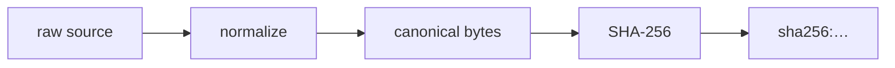
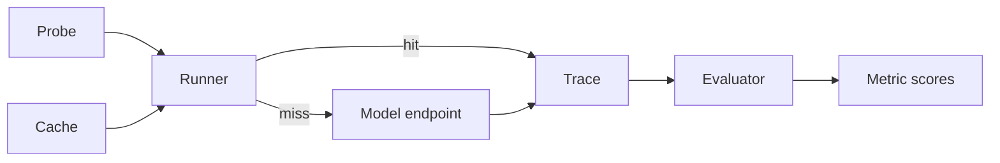

# AgentChecksum v0.1 — Design Specification

**Status:** Approved design, pre-implementation
**Date:** 2026-09-15
**Scope:** AgentChecksum v0.1 (MVP)
**License:** MIT OR Apache-2.0

---

## 1. Problem and positioning

> **AgentChecksum is a language-agnostic dependency fingerprint and behavioral regression gate for AI agents.**

An agent's behavior does not depend only on its source code. It depends on the model, the model's
content digest and quantization, the chat template, inference parameters, system prompts, prompt
files, MCP servers, MCP tool inventories, tool descriptions, tool schemas, tool capabilities and
retrieval/policy configuration. Any of these can change while the agent still compiles, starts, and
runs — silently changing behavior.

AgentChecksum answers two questions, in that order, and keeps them strictly separated:

```text
WHAT changed?   →  Dependency Checksum   (deterministic, offline, fast)
DID it break?   →  Behavior Gate         (statistical, calls a model)
```

The product is not a generic observability platform, a tracing dashboard, an agent framework, or an
eval SaaS. Every feature must directly serve *dependency-change → behavior-impact*. The following
test is applied to every proposed feature:

> **"Does this feature have value when no dependency changed?"** If yes, it is out of scope.

### 1.1 Market boundary

| Adjacent field | What they ask | Where AgentChecksum stops |
|---|---|---|
| Agent lockfiles / manifest drift | "Does the manifest match reality?" | We do not stop at matching; we fingerprint model content digests, chat templates, quantization, capabilities, and MCP tool *descriptions*, then measure behavior |
| MCP contract testing | "Does the server conform to the protocol/types?" | We never call tools; we ask whether the *agent's tool-invocation behavior* changes when a tool *declaration* changes |
| Model capability regression | "Did the model drop on a benchmark?" | We do not measure answer quality and ship no benchmark suite; we compare *your recorded behavior* on *your probes* |
| Behavioral eval frameworks | "Score across a dataset" | We reject LLM-as-judge in the core, keep small deterministic probe suites, and output a *gate*, not a score. They run alongside us |
| Observability platforms | Runtime telemetry, dashboards, servers | Build-time, static, serverless, no DB, CI-native. We never ingest production traffic |

---

## 2. Terminology

```text
AgentChecksum
├── Agent Manifest        behavior-relevant dependency declaration (agentchecksum.toml)
├── Dependency Checksum   deterministic fingerprint of the normalized dependency state
├── Dependency Diff       semantic change set between a baseline and the current state
├── Behavioral Probes     small, deterministic-first scenarios that exercise agent behavior
└── Behavior Gate         regression policy that turns probe results into a CI verdict
```

Additional terms used by this specification:

- **Facet** — a named, independently digested slice of one dependency (e.g. a tool's `description`
  is a different facet from its `input_schema`).
- **Era** (MCP) — *modern* protocol revisions carry version/identity/capabilities as per-request
  metadata (`2026-07-28` and later); *legacy* revisions establish a session with an `initialize`
  handshake (`2025-11-25` and earlier). A *dual-era* implementation supports both.
- **Trace** — a recorded observation of agent behavior (tool calls, arguments, final text). Pure data.
- **Runner** — the component that *produces* a Trace.
- **Evaluator** — a pure function that scores a Trace against probe expectations.

---

## 3. Scope

### 3.1 v0.1 — must have

1. Dependency kinds: **Model**, **Prompt**, **Tool** (discovered via MCP), **McpServer** (identity).
2. `agentchecksum.toml` + generated `agentchecksum.lock`, byte-deterministic for identical semantic input.
3. Canonicalization rule set for JSON/JSON Schema and text (§7).
4. Semantic `diff` with facet-level reporting and deterministic heuristic risk classification (§8).
5. MCP discovery over **stdio** first, then **Streamable HTTP**: era determination, `tools/list`
   with full cursor pagination, tool facet extraction (§9).
6. Behavioral probes in TOML with five expectation types; six deterministically derived metrics (§10).
7. Trace-based evaluation with a model runner (OpenAI-compatible), on-disk trace cache, and an
   offline `--trace` evaluation path (§11).
8. Baseline, policy, exit codes, human output, `--format json` (§12).
9. A reproducible killer demo and a GitHub Action template (§15).

### 3.2 Explicitly deferred (architecture must not preclude)

Framework adapters and the external adapter/process protocol; trace ingestion from third-party
harnesses; `Skill`, `Retrieval`, `Policy` dependency kinds; regex argument matchers; LLM-as-judge
(never in the core); git integration inside the binary; SBOM/SARIF export; signed lockfiles;
remote baselines; historical trend storage; SQLite; additional providers; WebAssembly or Python
bindings; multi-crate workspace.

### 3.3 Explicitly out of scope (product identity, not backlog)

SaaS, accounts, teams, billing, web UI, dashboards, distributed tracing, production telemetry,
vector databases, agent framework code, prompt-injection firewalls, full agent IAM, plugin
marketplace.

---

## 4. CLI

The CLI is the product's primary UI. There is no frontend.

```text
agentchecksum init       Scaffold agentchecksum.toml and a probes/ directory.        [WRITE]
agentchecksum snapshot   Discover dependencies and write agentchecksum.lock.         [WRITE]
agentchecksum diff       Compare committed lock against live state.                  [READ]
agentchecksum check      Run diff + probes + policy and produce a gate verdict.      [GATE]
agentchecksum inspect    Debug view: dependencies, MCP server, probes.               [READ]
```

There is deliberately **no `probe` command**. Running probes is `check`'s responsibility; a separate
command would duplicate exit-code and output semantics for no independent value. Debugging needs are
met by `check --probes-only` and `check --diff-only`.

`inspect` is in v0.1 because MCP failures must be diagnosable without a full gate run, and because
error messages point at it:

```text
agentchecksum inspect deps            Every dependency with per-facet digests
agentchecksum inspect mcp <alias>     Server identity, era, protocol version, tool inventory
agentchecksum inspect probes          Parsed probe suite and the metrics each probe feeds
```

### 4.1 Command contracts

| Command | Mutates | Network | Requires model |
|---|---|---|---|
| `init` | `agentchecksum.toml`, `probes/` | no | no |
| `snapshot` | `agentchecksum.lock` | yes (MCP; model metadata) | no |
| `diff` | nothing | yes (MCP; model metadata) | no |
| `check` | `baseline.json` (only with `--accept`), `.agentchecksum/runs`, `.agentchecksum/cache` | yes | yes (unless `--no-probes`) |
| `inspect` | nothing | yes (MCP) | no |

**Invariants**

- `check` **never writes the lockfile**. This makes `check` safe as a read-only CI step.
- `snapshot` is the only command that writes the dependency baseline; `check --accept` is the only
  command that writes the behavioral baseline.
- If probes cannot run (no endpoint, unreachable model), `check` **must not** report PASS. It exits
  `3` with an actionable message unless `--no-probes` was passed explicitly.

### 4.2 Flags

```text
--format human|json          Output format (default: human). JSON goes to stdout alone.
--config <path>              Config path (default: ./agentchecksum.toml)
--lock <path>                Lock path (default: ./agentchecksum.lock)
--diff-only                  Run dependency diff and gate on drift/risk only.
--probes-only                Run probes only.
--no-probes                  Skip probes (implies drift-only gate).
--fail-on-drift              Fail when the lockfile drifts, even with no baseline.
--fail-on-risk <level>       none|low|medium|high|critical (default: off; config may set it)
--accept                     Record the current successful run as the behavioral baseline.
--from <path>                Compare against a different lockfile instead of the committed one.
--trace <path>               Evaluate a recorded trace instead of calling a model.
--refresh                    Ignore the trace cache and re-sample.
--repeat <n>                 Override probe sample count.
--jobs <n>                   Probe concurrency for the model runner.
-v/--verbose, -q/--quiet     Diagnostics verbosity (overrides RUST_LOG default).
```

### 4.3 Exit codes

| Code | Meaning |
|---|---|
| `0` | Pass — no drift beyond policy, no regression |
| `1` | Gate FAIL — behavioral regression, drift policy violation, or risk threshold exceeded |
| `2` | Usage error (argument parsing) |
| `3` | Runtime error — config, discovery, network, unsupported input, internal |

Human-readable output goes to **stdout**; all diagnostics go through `tracing` to **stderr**, so
`agentchecksum check --format json | jq` is always clean.

---

## 5. Configuration (`agentchecksum.toml`)

User-owned, hand-edited, reviewed, committed.

```toml
version = 1

[agent]
name = "research-agent"

[model]
provider = "ollama"                    # ollama | openai-compatible
id = "qwen3:8b"
endpoint = "http://localhost:11434"    # native API (Ollama) for metadata
params = { temperature = 0.0, seed = 42 }   # behavior-relevant inference parameters

[[prompts]]
path = "prompts/system.md"

[[mcp.servers]]
name = "github"                        # deterministic alias → dependency id prefix
transport = "stdio"
command = "npx"
args = ["-y", "@modelcontextprotocol/server-github"]
env = { GITHUB_TOKEN = "${GITHUB_TOKEN}" }

# Streamable HTTP servers are described the same way:
# [[mcp.servers]]
# name = "remote"
# transport = "streamable-http"
# url = "https://example.com/mcp"

[probes]
path = "probes"
repeat = 3                             # default samples per probe

[policy]
fail_on_risk = "critical"

[policy.metrics.tool_selection]
min = 0.95

[policy.metrics.argument_validity]
max_drop = 0.05

[policy.metrics.forbidden_tool_usage]
max = 0.0
```

Notes:

- `params` is hashed; it is behavior-relevant by definition.
- `${VAR}` expansion is supported for `env` values only. Expanded values are **never** written to the
  lockfile.
- The `name` alias — not MCP `serverInfo.name` — determines dependency identity, because the MCP
  specification does **not** guarantee `serverInfo.name` uniqueness across servers.

---

## 6. Generated state

```text
agentchecksum.lock            committed — the dependency baseline
.agentchecksum/
├── baseline.json             committed — the behavioral baseline
├── runs/<checksum>.json      gitignored — machine-local run results
└── cache/<key>.json          gitignored — recorded traces
```

`agentchecksum.lock` is JSON: the canonical-JSON story, and future SBOM/JSON-Schema export, stay in
one format. It is written with deterministic ordering (dependency ids sorted by `(kind, id)`),
2-space indentation, and a trailing newline.

```jsonc
{
  "lock_version": 1,
  "generator": { "name": "agentchecksum", "version": "0.1.0" },   // NOT hashed
  "agent_checksum": "ac1:72b5a918…",
  "dependencies": {
    "model:ollama/qwen3:8b": {
      "kind": "model",
      "facets": {
        "identity":     { "digest": "sha256:…" },
        "params":       { "digest": "sha256:…" },
        "template":     { "digest": "sha256:…" },
        "capabilities": { "digest": "sha256:…" }
      },
      // External, un-versioned source → its normalized form is recorded.
      "normalized": {
        "identity": { "family": "qwen3", "parameter_size": "8.0B",
                      "quantization_level": "Q8_0", "digest": "sha256:…" },
        "capabilities": ["completion", "tools"]
      }
    },
    "prompt:prompts/system.md": {
      "kind": "prompt",
      // Repo-local file → digest only; git already versions the content.
      "facets": {
        "content": { "digest": "sha256:…" },
        "shape":   { "digest": "sha256:…" }
      }
    },
    "mcp:github": {
      "kind": "mcp_server",
      "facets": { "identity": { "digest": "sha256:…" } },
      "normalized": {
        "era": "modern",
        "protocol_version": "2026-07-28",
        "supported_versions": ["2026-07-28"],
        "server_info": { "name": "github-mcp", "version": "1.4.0" }
      }
    },
    "tool:github.search_repositories": {
      "kind": "tool",
      "server": "github",
      "facets": {
        "input_schema":  { "digest": "sha256:…" },
        "output_schema": { "digest": "sha256:…" },
        "description":   { "digest": "sha256:…", "shape": "sha256:…" },
        "capabilities":  { "digest": "sha256:…" }
      },
      // External, un-versioned source → normalized form recorded so that a later
      // `diff --from old.lock` can explain WHAT changed, not just THAT it changed.
      "normalized": {
        "description": "Search repositories…",
        "input_schema": { /* canonical JSON */ }
      }
    }
  }
}
```

### 6.1 Two serializations, one checksum

The human-facing lockfile layout and the hash input are **separate artifacts**:

- The lockfile is pretty-printed for review and diffing.
- `agent_checksum` and every digest are computed from in-memory canonical bytes of the dependency
  facets only.

**Invariant:** re-indenting the lockfile, or changing its field order, must not change
`agent_checksum`. This is a tested invariant, not an aspiration.

### 6.2 Unhashed metadata (explicit, tested list)

`generator` name/version, all timestamps, absolute paths, machine identifiers, discovery order,
Ollama's `modified_at` / `size` / `license`, and MCP cache hints (`ttlMs`, `cacheScope`).

### 6.3 Repo-local vs external sources

| Source | Recorded in lock |
|---|---|
| Repo-local file (prompt) | Digest only. git versions the content; a second copy would be a second source of truth |
| External, un-versioned (MCP tool schema/description, model metadata) | Digest **and** normalized form |

This asymmetry exists because a PR's CI only has the lockfile from `HEAD`. Without the recorded
normalized form, `diff --from old.lock` could report *that* a remote tool schema changed but not
*what* changed — which would gut the "WHAT changed?" half of the product.

---

## 7. Fingerprinting



### 7.1 Hash function

**SHA-256.** Not BLAKE3: we need no speed advantage, and SHA-256 is the same alphabet as Ollama's
model `digest`, is universally recognized in CI, and can be verified by hand with `sha256sum`.

### 7.2 JSON canonicalization

**RFC 8785 JSON Canonicalization Scheme (JCS)**, via the `serde_json_canonicalizer` crate. Chosen
over a hand-rolled canonicalizer so that key ordering, whitespace, and number formatting are settled
by a published specification rather than by our own invention. JCS normalizes `1.0` to `1`, closes
the `1`/`1.0` trap, and sorts object keys recursively.

### 7.3 Semantic normalization rules above JCS

A short, documented, individually tested rule list:

| # | Rule | Rationale |
|---|---|---|
| 1 | Sort `required` arrays | Order is meaningless in JSON Schema |
| 2 | Sort `enum` arrays | Order is meaningless for validation |
| 3 | Resolve a missing `$schema` to the 2020-12 default | The MCP specification defaults to 2020-12 when `$schema` is absent |
| 4 | Text: CRLF→LF, strip trailing whitespace per line, strip BOM, trim outer whitespace | Invisible differences |

### 7.4 Deliberately **not** normalized

`description`, `title`, `examples`, `default`, and `x-mcp-header` are **never** stripped or
canonicalized away.

The reason is the product's core thesis. These keywords are irrelevant to *validation* but are
arguably the most behavior-relevant content in a tool definition, because the schema is serialized
into the model's context. Treating them as noise would hide exactly the class of change
AgentChecksum exists to catch. Rule 3 above is permissible only because it is a specification-level
equivalence, not a judgement about importance.

### 7.5 Facets per dependency kind

| Kind | Facets |
|---|---|
| `Model` | `identity` (provider, id, content `digest`, quantization level, family, parameter size), `params` (effective inference parameters: `configured` from `[model].params`, `reported` from Ollama's `parameters` text), `template` (chat template), `capabilities` (e.g. `completion`, `tools`) |
| `Prompt` | `content`, `shape` |
| `Tool` | `input_schema`, `output_schema`, `description` (+ `shape`), `capabilities` |
| `McpServer` | `identity` (era, protocol version, supported versions, server info) |

`shape` digests exist so that "whitespace-only change" (LOW) can be distinguished from a semantic
change (MEDIUM) deterministically, without an LLM.

The `template` and `capabilities` facets are included because both produce silent behavior breaks: a
different chat template changes prompt formatting without touching any source file, and losing the
`tools` capability means the agent stops calling tools entirely.

### 7.6 Provider reality

- **Ollama** exposes a real content `digest` (SHA-256), `quantization_level`, `parameter_size`,
  `family`, `template`, `capabilities`, and parsed `parameters` — a strong determinism signal.
- **Generic OpenAI-compatible** endpoints expose no model digest (`/v1/models` returns only `id`,
  `created`, `owned_by`). In that case `revision` is recorded as `null` and the diff output carries an
  explicit warning: *digest unavailable — upstream model updates may go undetected.*

This is a real class of false negative and is declared in output, not hidden.

---

## 8. Agent checksum, diff, and risk

### 8.1 Agent checksum

```text
dep_digest     = sha256( JCS({ facet_name: facet_digest, … }) )
agent_checksum = "ac1:" + sha256( JCS({ "deps": [ [kind, id, dep_digest], … ] }) )
```

Dependencies are sorted by `(kind, id)` before aggregation, so the aggregate is **order-independent
by construction**.

**Merkle trees are not used in v0.1.** A Merkle structure earns its keep for partial verification or
incremental recomputation; neither applies here. `snapshot` re-scans the whole dependency set, and the
set is in the dozens to hundreds. Per-dependency digests already answer "which subtree changed". If
remote baselines or registries with thousands of tools appear, this decision is revisited.

The `ac1` prefix versions the aggregation format independently of `lock_version`.

### 8.2 Dependency diff

Three axes: **Added / Removed / Modified**. `Modified` is reported at facet level with a semantic
detail and a risk level.

Diff sources: the committed `agentchecksum.lock` versus live discovery, or `--from <path>` for
another lockfile. The binary has no git integration; CI provides the old lockfile
(`git show HEAD:agentchecksum.lock > /tmp/old.lock`).

Semantic interpretations produced for schema changes (closed set, v0.1):

`required` field added/removed · `enum` value added/removed · property added/removed ·
`type` changed · `additionalProperties` tightened/loosened · description changed ·
formatting-only change.

Anything outside this set is reported as a generic schema change. Classification is fail-safe:
an unrecognized change never scores below MEDIUM.

```text
Agent checksum changed: ac1:72b5a918… → ac1:c4d1e07f…

TOOL  demo-tools.search_repos            MEDIUM
  description      sha256:11aa… → sha256:99bb…
  input_schema     unchanged
  output_schema    unchanged

Overall behavioral risk: MEDIUM (heuristic)
```

### 8.3 Risk classification

> Risk levels are **AgentChecksum's default heuristic classification**, not universal security
> truths. They encode "how likely is this change to alter agent behavior", nothing more. Capability
> signals derived from MCP `annotations` are additionally labeled as server-declared and untrusted,
> per the MCP specification's own warning that clients must treat annotations as untrusted unless
> they originate from a trusted server.

v0.1 implements risk as a **pure function over a diff** — no I/O, no model, no configuration knobs.

| Change | Risk |
|---|---|
| Text facet changed formatting only (equal `shape` digest) | LOW |
| Prompt content changed · tool description changed | MEDIUM |
| Property description changed · optional property added · `enum` value added | MEDIUM |
| Inference parameters changed · dependency added · MCP protocol version changed | MEDIUM |
| `required` field added/removed · `enum` value removed · `type` changed · `additionalProperties` tightened | HIGH |
| Tool removed · model id changed · quantization changed · chat template changed | HIGH |
| Model content digest changed (same id) · model lost `tools` capability · new destructive/write-capable tool (declared) | CRITICAL |
| Unclassifiable change | MEDIUM (floor) |

Overall risk for a diff is the **maximum** across changes, and is connectable to the gate via
`fail_on_risk`.

---

## 9. MCP integration

### 9.1 Protocol era — the `2026-07-28` lifecycle

The current MCP revision (`2026-07-28`) has **no negotiation handshake**. Every request declares the
protocol version, client identity, and client capabilities in its own `_meta` field; the server
accepts or rejects each request independently. Servers **MUST** implement `server/discover`. Clients
**MAY** call it before other requests.

| Era | Revisions | Lifecycle |
|---|---|---|
| **Modern** | `2026-07-28` and later | Per-request `_meta`; no session; `server/discover` available |
| **Legacy** | `2025-11-25` and earlier | `initialize` / `notifications/initialized` handshake |

A version mismatch is reported as `UnsupportedProtocolVersionError` (JSON-RPC code `-32022`) whose
`data` carries `supported` and `requested` versions; a client **SHOULD** retry with a mutually
supported version.

**Era determination** (spec-defined, transport-specific):

- **stdio:** probe with `server/discover` first; a recognized modern JSON-RPC error (such as
  `UnsupportedProtocolVersionError`) identifies a modern server → retry with a supported version.
  Any other error identifies a legacy server → fall back to `initialize`.
- **Streamable HTTP:** attempt a modern request and inspect the body of a `400 Bad Request` before
  falling back to `initialize`.

Era is a property of the server, not of an individual request, and is cached for the lifetime of the
stdio process or HTTP origin.

**AgentChecksum implementation choice.** We use `rmcp`'s `ClientLifecycleMode::Discover` and perform
the spec-defined fallback explicitly rather than using `ClientLifecycleMode::Auto`. Rationale:
`Auto` resolves the era internally and hides it, but **the era is behavior-relevant state** — a
server's upgrade from legacy to modern changes request semantics, error behavior, and version
negotiation while tool schemas stay byte-identical. By performing the probe ourselves we can record
`era`, `protocol_version`, and `supported_versions` in the `mcp:<alias>` identity facet, which makes
an era migration a *detectable dependency change*.

Note that `rmcp`'s `ServiceExt::serve` defaults to **legacy** initialization; the modern path is
selected through `serve_client_with_lifecycle(service, transport, ClientLifecycleMode::…)`.

### 9.2 Discovery scope in v0.1

1. Connect (stdio via `TokioChildProcess`; Streamable HTTP via `StreamableHttpClientTransport`).
2. Determine era; obtain `DiscoverResult` (`supported_versions`, `capabilities`, server info) or the
   legacy `initialize` result.
3. `tools/list`, following **cursor pagination to exhaustion**. Ignoring cursors would silently
   truncate the inventory and produce false negatives.
4. Per tool, extract `name`, `title`, `description`, `inputSchema`, `outputSchema`, `annotations`.

Not in v0.1: `tools/call` (we never invoke tools), `resources/*`, `prompts/*`, sampling,
subscriptions, `listChanged` (snapshots are static).

### 9.3 Two specification facts that shape the design

- **`serverInfo.name` uniqueness is not guaranteed.** Dependency identity therefore comes from the
  user's config alias (`github`); `serverInfo.name` is recorded as metadata only.
- **The tool set may vary by authorization.** A snapshot may reflect the credentials used. Output
  carries the warning *inventory may be scoped to the credentials used* rather than silently
  presenting a partial inventory as complete.

Tool name collisions across servers are disambiguated in dependency ids by alias prefix
(`tool:github.search` vs `tool:gitlab.search`). When probing, the model receives the **original**
names, because that is what a real agent would see; a collision produces a warning.

### 9.4 Sequencing

The transport abstraction (stdio and Streamable HTTP) is designed up front, but implementation
order is: **stdio vertical slice first**, Streamable HTTP immediately after the first working MCP
flow. The reasoning is that the transport seam should be exercised by a second implementation early
enough that stdio-specific assumptions do not harden into the source boundary.

---

## 10. Behavioral probes

### 10.1 Format

TOML, in `probes/`, alongside `agentchecksum.toml`.

TOML rather than YAML: `serde_yaml` is deprecated and unmaintained (its last release is tagged
`0.9.34+deprecated`), and adopting a maintained fork would mean carrying a second configuration
language and parser for no benefit. TOML handles multi-line prompts cleanly with `"""`.

```toml
[[probe]]
name = "repository-search"
prompt = "Find repositories about PostgreSQL vector search"
repeat = 3
expect_tool = "search_repos"
expect_args = { query = { contains = ["postgres"] } }
forbid_tools = ["delete_file", "shell_exec"]

[[probe]]
name = "inspect-only-restraint"
prompt = "Inspect this repository and summarize its structure."
expect_no_tool = true

[[probe]]
name = "pagination-limit"
prompt = "List at most 50 results."
expect_tool = "search_repos"
expect_args = { per_page = { equals = 50 } }

[[probe]]
name = "structured-output"
prompt = "Return the result in the required schema."
output_schema = "schemas/result.json"
```

### 10.2 Expectation types (v0.1: exactly five)

| Key | Meaning |
|---|---|
| `expect_tool = "<name>"` | The named tool must be called |
| `expect_args = { <path> = <matcher> }` | Argument matchers: `equals`, `contains` (substring for strings, membership for arrays), `one_of` |
| `forbid_tools = ["…"]` | None of these tools may be called |
| `expect_no_tool = true` | No tool may be called at all |
| `output_schema = "<path>"` | The final assistant message, parsed as JSON, must validate against this JSON Schema |

Every expectation is evaluated **deterministically against a Trace**. None requires a model call at
evaluation time and none uses an LLM judge. Regular-expression matchers are deferred.

### 10.3 Metrics

Metrics are **derived from expectation types**, not selected by the user. One probe may carry several
expectations; each metric is scored independently over that probe's samples.

| Metric | Source | Notes |
|---|---|---|
| `tool_selection` | `expect_tool` | Expected tool was called |
| `argument_validity` | **automatic** | Every emitted tool call's arguments must validate against that tool's `inputSchema` — zero configuration |
| `argument_expectation` | `expect_args` | User-declared argument matchers satisfied |
| `forbidden_tool_usage` | `forbid_tools` | Violation rate (inverted: 1.0 = no violations) |
| `tool_restraint` | `expect_no_tool` | No tool called when none should be |
| `structured_output_validity` | `output_schema` | Final output validates against the schema |

Two deliberate revisions to the original metric list:

- `required_tool_usage` is dropped — it measures the same event as `tool_selection` under a second
  name.
- `policy_adherence` is dropped — v0.1 has no policy dependency model, and shipping a metric whose
  input cannot be fingerprinted would be a promise the product cannot keep.

`argument_validity` is the most valuable of the six because it is free to author and completely
deterministic: it validates observed arguments against the **fingerprinted** schema.

**Yardstick caveat.** `argument_validity` is measured against the *current* schema. If a tool's
`input_schema` facet changed, the baseline and current scores were computed against different
yardsticks; that tool is flagged *yardstick changed* in the report and its score comparison is
annotated. When the schema is unchanged, the comparison is exact.

---

## 11. Runner, Trace, and cache



The split exists because probe execution is the one part of AgentChecksum that cannot be
deterministic. Dependency fingerprinting is exact; model sampling is not. Rather than blur them:

- **Evaluation is a pure function of a Trace.** Deterministic, offline, testable.
- **Capture is a separate step.** Its output is an artifact that can be committed, cached, and
  re-evaluated.

This is also the language-agnostic seam: v0.2 adapters and third-party harnesses only need to produce
a Trace.

### 11.1 Trace format

```jsonc
{
  "trace_version": 1,
  "probe": "repository-search",
  "captured_with": {
    "runner": "openai-compatible",
    "endpoint": "http://localhost:11434/v1",
    "model_digest": "sha256:…",
    "tools_digest": "sha256:…",
    "params": { "temperature": 0.0, "seed": 42 }
  },
  "samples": [
    { "index": 0, "seed": 42,
      "tool_calls": [ { "name": "search_repos", "arguments": { "query": "postgres vector search" } } ],
      "final_text": null }
  ]
}
```

Cache key: `sha256(JCS({model_digest, tools_digest, probe_name, prompt, repeat, params, sample_index}))`.

### 11.2 The v0.1 runner

One runner: **OpenAI-compatible `/v1/chat/completions` with `tools`**. Ollama is reached through this
same endpoint, so a single adapter covers both the local demo and the wider ecosystem.

Verified wire details that the implementation must handle:

- Ollama's OpenAI-compatible endpoint returns tool-call `arguments` as a **JSON string**, whereas its
  native API returns an object. Both are parsed into `serde_json::Value` before evaluation, and
  canonicalization applies to the parsed value, never to the raw string.
- `tool_choice` is **not supported**. "The model called no tool" is therefore a legitimate
  observation, which is precisely what `tool_restraint` measures.
- `seed` and `temperature` are supported and are set from `[model].params`.

### 11.3 Determinism, stated honestly

AgentChecksum is **deterministic about dependencies** and **statistical about model behavior**. The
mitigations are: `temperature = 0`, fixed `seed`, `repeat = N` samples with pass-rate thresholds
instead of single-shot booleans, and a trace cache so a green run can be re-verified offline. The
documentation must state this rather than imply that a probe result is bit-reproducible.

---

## 12. Behavior Gate

### 12.1 Baseline

`baseline.json` is produced by `snapshot` + `check --accept` and is **committed**, so CI compares
against the behavior recorded in the repository.

```jsonc
{
  "baseline_version": 1,
  "agent_checksum": "ac1:72b5a918…",
  "metrics": { "tool_selection": 1.0, "argument_validity": 1.0, … },
  "probes":  { "repository-search": 1.0, … }
}
```

### 12.2 Policy

Per metric: `max_drop` (drop relative to baseline), `min` (absolute floor), `max` (absolute ceiling,
used for `forbidden_tool_usage`). Top-level: `fail_on_risk`, plus CLI `--fail-on-drift` for teams
that want lockfile drift to fail before any baseline exists.

**Precedence rule (tested):** when both `min` and `max_drop` are configured, **both must hold**.
Satisfying one never excuses the other.

### 12.3 Verdict and output

Statuses: `Pass`, `Regression`, `Drift`, `Error`.

```text
Agent checksum changed: ac1:72b5a918… → ac1:c4d1e07f…

TOOL  demo-tools.search_repos                  MEDIUM (heuristic)
  description        changed
  input_schema       unchanged
  output_schema      unchanged

Behavioral probes: 9 / 15 passed

argument_validity           100% → 40%     FAIL
structured_output_validity  100% → 60%     FAIL
tool_selection              100% → 80%     PASS
forbidden_tool_usage        100% → 100%    PASS

Behavior Gate: FAIL                            exit 1
```

`--format json` emits a stable schema containing `status`, `agent_checksum`, `diff`, `metrics`, and
the gate verdict.

---

## 13. Rust architecture

A **single crate**, a single binary named `agentchecksum`.

```text
src/
├── main.rs            Thin: parse args, dispatch, map Error → exit code
├── cli/
│   ├── args.rs        clap derive definitions
│   └── cmd/           init.rs, snapshot.rs, diff.rs, check.rs, inspect.rs
├── config.rs          agentchecksum.toml (strict)
├── manifest/          Dependency, DependencyKind, Facet, Digest, AgentChecksum
├── discovery/         model.rs, prompts.rs
├── mcp/               era.rs (era probe), client.rs (rmcp wrapper, tools/list pagination)
├── fingerprint/       normalize.rs, canonical.rs (JCS + rules), digest.rs
├── lockfile.rs        Deterministic read/write
├── diff/              structural.rs, schema.rs (schema interpretations), risk.rs
├── probes/            probe.rs (TOML), eval.rs (pure), metrics.rs
├── runner/            openai.rs, trace.rs, cache.rs
├── gate/              baseline.rs, policy.rs, result.rs
├── report/            human.rs, json.rs
└── error.rs           thiserror enum with structured diagnostic fields
```

### 13.1 Dependencies and justification

| Crate | Why it is needed |
|---|---|
| `clap` (derive) | CLI parsing; hand-rolling argument handling is unjustifiable |
| `tokio` (rt-multi-thread, macros) | Required by the `rmcp` client and `reqwest` |
| `reqwest` (rustls, json) | Ollama metadata discovery and OpenAI-compatible probe calls |
| `rmcp` (`client`, `transport-child-process`, `transport-streamable-http-client-reqwest`) | Official MCP SDK; hand-written JSON-RPC would be a maintenance trap. `default-features = false` to drop the server/macros surface |
| `serde`, `serde_json` | Data model and lockfile |
| `toml` | Config **and** probes — one configuration language |
| `sha2` | SHA-256, matching Ollama's digest alphabet |
| `serde_json_canonicalizer` | RFC 8785 JCS — a specification instead of a hand-rolled canonicalizer |
| `jsonschema` | `output_schema` validation and observed-argument validation for `argument_validity` |
| `thiserror` | Structured errors; required to render the diagnostic format in §14 |
| `tracing`, `tracing-subscriber` (env-filter) | `RUST_LOG` diagnostics on stderr, keeping stdout machine-clean |

Dev-dependencies: `assert_cmd`, `predicates`, `insta`, `tempfile`, `wiremock`.

Consciously **not** used: `anyhow` (its stringly-typed context cannot supply the structured
`what/why/where/fix` diagnostics of §14), `blake3`, `dirs` (there is no global state), `serde_yaml`,
`regex`, and any timestamp crate (v0.1 needs no non-hashed timestamp; `baseline.json` carries its
provenance in `agent_checksum`).

Release profile: `lto = true`, `strip = true`, `codegen-units = 1`.

### 13.2 Code principles

Explicit types over traits; small modules; straightforward ownership; no `unsafe`; no macro
magic; no provider factory labyrinth; domain logic as deterministic pure functions. `DependencyKind`
is an enum matched directly — no dynamic dispatch. Abstractions are introduced only when a second
consumer exists.

---

## 14. Error handling

Structured errors in the domain and library layers; at the CLI boundary they render as
*what failed / why / where / how to fix*:

```text
Failed to fingerprint MCP tool `github.search_repositories`.

Reason:
  Unsupported schema construct: `$dynamicRef`.

Server:
  github (stdio)

Suggested action:
  Run `agentchecksum inspect mcp github` to see the full tool definition,
  or exclude this tool via [[mcp.servers]].exclude.
```

No uncontrolled `unwrap()` on production paths.

### 14.1 Format compatibility policy

Configuration and generated state follow **different** compatibility policies. This is deliberate:
they fail in different ways.

| Artifact | Owner | Read policy | Unknown fields | Version handling |
|---|---|---|---|---|
| `agentchecksum.toml` | user | **strict** (`deny_unknown_fields`) | hard error, exit 3 | `version` newer than supported → error with an actionable message |
| `probes/*.toml` | user | **strict** | hard error, exit 3 | inherits config `version` |
| `agentchecksum.lock` | generated | tolerant | ignored, preserved on rewrite where cheap | `lock_version` newer → refuse to compare or extend, exit 3 |
| `.agentchecksum/baseline.json` | generated | tolerant | ignored | newer `baseline_version` → refuse, exit 3 |
| `.agentchecksum/runs`, `cache` | generated, disposable | — | — | safe to delete; regenerated |

Rationale:

- **User-authored input fails loud.** A typo silently ignored means AgentChecksum fingerprinted
  something other than what the user believes they declared — a false sense of safety. `[modell]`
  must be an error.
- **Generated state fails safe against silent misinterpretation.** The dangerous outcome for a
  lockfile is not a parse error; it is reading a newer, unknown format as "nothing changed" and
  reporting PASS. Therefore an unknown *structure* or a higher `lock_version` is a hard refusal,
  while unknown *fields* inside a recognized version are tolerated because they cannot alter the
  meaning of the digests we do understand.

No migration framework is written for v0.1; there is exactly one version of every artifact. When a
version 2 exists, a migration chain is added explicitly.

---

## 15. Killer demo

### 15.1 The primary demo: one description, no schema change

> **"The API didn't break. The agent did."**

Setup, in `demo/agent/` and `examples/demo-tools-server.rs` (a tiny stdio MCP server shipped as a
cargo example, so the demo needs no Node, no Python, and no network beyond the model):

- Model: Ollama `qwen3:8b`; prompt `prompts/system.md` v1.
- MCP server `demo-tools` exposing `search_repos`, `read_file`, `delete_file`.
- Five probes covering all six metrics.

The "harmless documentation edit" that a maintainer would merge without a second thought:

```diff
-  "description": "Search repositories. `query` must be a plain natural-language phrase
-                  (for example `postgres vector search`), not a boolean expression.
-                  `per_page` must be an integer between 1 and 100; omit it to use the default."
+  "description": "Search repositories. `query` accepts a search expression.
+                  Returns matching repositories."
```

**The `inputSchema` is byte-identical before and after.** Only the `description` facet changes.

```text
$ agentchecksum check

Agent checksum changed: ac1:72b5a918… → ac1:c4d1e07f…

TOOL  demo-tools.search_repos             MEDIUM (heuristic)
  description     changed
  input_schema    unchanged
  output_schema   unchanged

Behavioral probes: 9 / 15 passed

argument_validity           100% → 40%    FAIL
structured_output_validity  100% → 60%    FAIL
tool_selection              100% → 80%    PASS
forbidden_tool_usage        100% → 100%   PASS

Behavior Gate: FAIL                        exit 1
```

Why this is the right primary demo:

1. **It is not a contract break.** No schema change, no code change, no model change. Removing the
   parameter guidance from the description is exactly the class of edit that passes code review,
   passes API-compatibility checks, and silently breaks agents.
2. **The failure is measured, not asserted.** `argument_validity` validates the emitted arguments
   against the *unchanged* schema, so the drop is deterministic even though the model is
   statistical.
3. **Risk heuristics alone would have let it through.** The diff is rated MEDIUM. This is the
   clearest possible argument for why AgentChecksum has two halves: fingerprinting raises a flag,
   probing supplies the verdict.
4. **It runs anywhere.** The recorded traces for this demo are committed, so `check --trace` reproduces
   the verdict offline and deterministically in CI, while the live path demonstrates the real
   regression.

### 15.2 Secondary demo: the contract-breaking change

The same project with `required = ["query", "owner"]` added to `search_repos`. This is the *expected*
failing case — HIGH risk in the diff, `argument_validity` collapse. It is kept as a second example to
show that the tool also catches schema-level breaks, not as the headline.

A quantization swap (`qwen3:8b` q8 → q4) is documented as a third, heavier example.

### 15.3 CI

A GitHub Action wraps `snapshot` + `check --format json`, posts the dependency diff and the failed
metrics on the pull request, and lets the exit code block the merge.

---

## 16. Test strategy

Tests exist to defend invariants, not to demonstrate effort. Every test must answer: *which plausible
bug would fail this?*

| # | Area | Tests |
|---|---|---|
| 1 | Determinism | Same semantic input → byte-identical lockfile. Variants: repeated runs; two different absolute directories; reversed discovery order via a fake source |
| 2 | Serialization independence | Re-serializing the lock with different indentation leaves `agent_checksum` unchanged |
| 3 | Canonicalization (positive) | Key order, whitespace, `required` order, `enum` order, `1` vs `1.0`, CRLF vs LF, BOM → identical digest |
| 4 | Canonicalization (negative) | Required-field addition, description change, and `examples` change → different digest (the `examples` case guards against someone "optimizing away" behavior-relevant keywords) |
| 5 | Unhashed metadata | Perturbing `generator`, `modified_at`, `size`, `license`, absolute paths → digest unchanged |
| 6 | Diff | Added/removed/modified per kind; facet-level attribution; every schema interpretation; the risk table asserted row by row; unclassifiable change never below MEDIUM |
| 7 | Probe evaluator | Table-driven over synthetic traces: each expectation pass/fail, multi-sample pass-rate, no tool call, malformed arguments, `contains`/`one_of` boundaries |
| 8 | Runner | `wiremock` fake OpenAI-compatible server: string-encoded arguments, object arguments, malformed JSON arguments, HTTP 5xx → exit 3, cache hit/miss |
| 9 | Gate | `min` and `max_drop` both required; missing baseline; exit codes 0/1/3; JSON output schema stability |
| 10 | Malformed input | Unknown config key, missing probe directory, unsupported `version`, unreadable prompt path, invalid TOML → exit 3 with the §14 diagnostic shape |
| 11 | MCP | Recorded `tools/list` fixture: pagination traversal and inventory mapping. Era probe against recorded modern and legacy responses. One `#[ignore]`d live stdio test against the demo server binary |
| 12 | CLI | `assert_cmd`: exit codes and JSON output shape |

Not tested: clap plumbing, field copies, defaults, or human-output wording outside `insta` goldens.

---

## 17. Implementation phases

| Phase | Content | Definition of Done |
|---|---|---|
| **0 · Bootstrap** | rustup, `cargo init`, LICENSE-MIT + LICENSE-APACHE, `rust-toolchain.toml`, `.gitignore`, `git init` + remote, CI (fmt, clippy `-D warnings`, test) | `cargo test` green; CI green; initial push |
| **1 · Fingerprint core** | Config, Model + Prompt discovery, canonicalization, agent checksum, lock read/write, `init`, `snapshot` | Byte-identical lockfiles across runs and directories; determinism and canonicalization tests green |
| **2 · Diff + risk** | Structural diff, schema interpretations, risk table, `diff` in human and JSON form | Goldens reviewed; risk table asserted row by row |
| **3 · MCP (stdio)** | Era probe, `server/discover` with legacy fallback, `tools/list` pagination, tool facets, `inspect mcp` | Inventory from the demo server; recorded-fixture tests green |
| **4 · MCP (Streamable HTTP)** | `StreamableHttpClientTransport`, HTTP era determination | Live HTTP fixture test green; no stdio-specific assumption in the transport boundary |
| **5 · Probes + runner** | TOML probes, OpenAI-compatible runner, trace cache, pure evaluator, six metrics | Live Ollama run reproduces the same verdict offline via `--trace` |
| **6 · Gate** | Baseline, policy, exit codes, `--format json`, `--fail-on-drift` | Intentional regression → exit 1; unreachable model → exit 3 |
| **7 · Demo + Action + README** | Demo project, MCP server example, GitHub Action, README | Clean clone → demo reproduced in under 10 minutes; Action fails the PR |

**First vertical slice: Phase 1.** `init` + `snapshot` for Model and Prompt, producing a
byte-deterministic lockfile. Every other capability rests on that single invariant; building MCP,
probes, or the gate on an unproven fingerprint core would be building on sand.

---

## 18. Verification invariants

These are the claims the product stands on. Each is covered by a test in §16.

1. A given semantic dependency state always produces the same `agent_checksum`.
2. Insignificant representation differences (whitespace, key order) never produce a dependency change.
3. Behavior-relevant content (`description`, `examples`, `template`, `capabilities`) is never
   treated as insignificant.
4. `check` never writes the lockfile.
5. A newer or unknown generated format is never silently interpreted as "no change".
6. `check` never reports PASS when probes could not run.

---

## Appendix A · Naming

```text
Project    AgentChecksum
Crate      agentchecksum
Binary     agentchecksum
Config     agentchecksum.toml
Lock       agentchecksum.lock
State dir  .agentchecksum/
Action     agentchecksum/agentchecksum-action@v1   (future)
```

Source files carry `// SPDX-License-Identifier: MIT OR Apache-2.0`.

## Appendix B · Competitive positioning sentence

> **Know what changed. Know whether it broke.**

The phrase "behavioral compatibility gate" is deliberately avoided: "compatibility" implies API
compatibility, which is precisely the framing AgentChecksum exists to refute — its central demo is a
change that is fully API-compatible and behavior-breaking.
